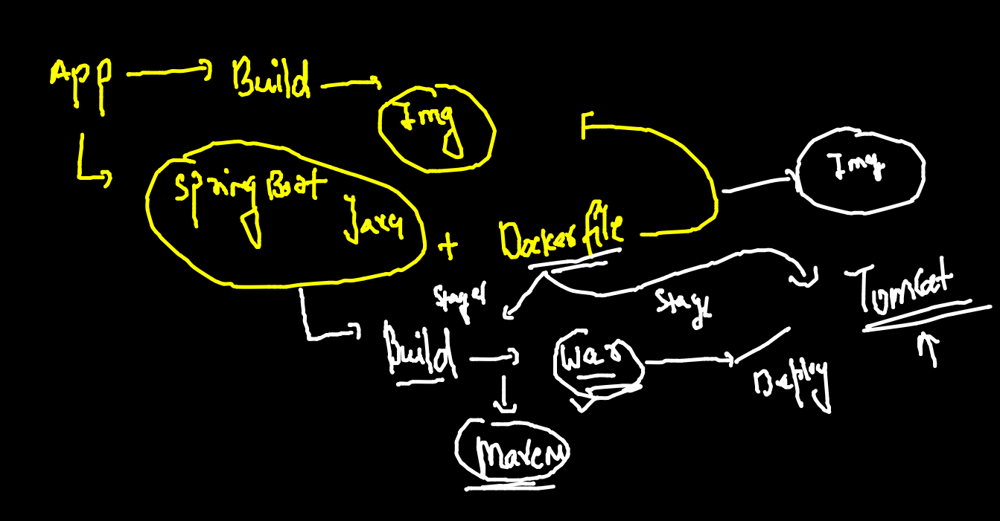
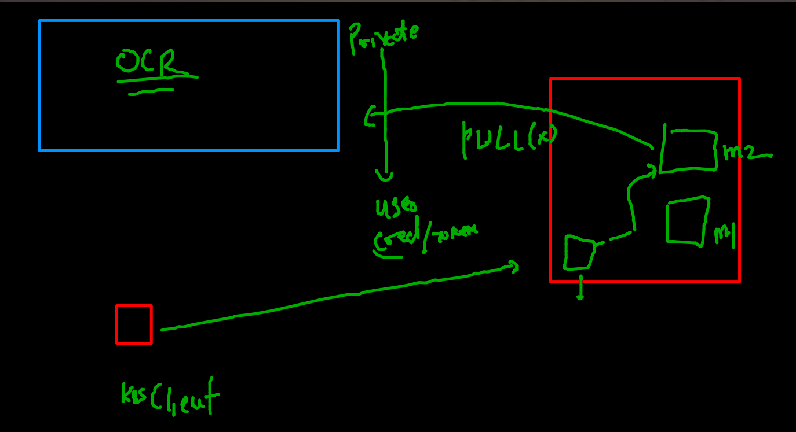
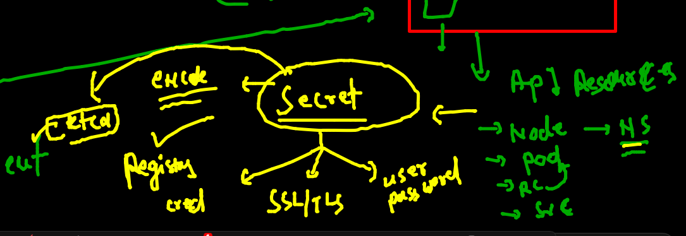

# Training Plan 


## java spring boot app containerization 

### Multi stage dockerfile comes in picture



### multistage docker 

```
FROM oraclelinux:8.3  as Builder
LABEL "name"="ashutoshh"
RUN dnf install java-1.8.0-openjdk.x86_64 java-1.8.0-openjdk-devel.x86_64  -y
RUN dnf install maven -y
RUN mkdir /javawebapp
WORKDIR /javawebapp
COPY . . 
# to build project into war file -- /javawebapp/target/WebApp.war 
RUN mvn clean package


FROM tomcat 
MAINTAINER ashutoshh@linux.com
COPY  --from=Builder  /javawebapp/target/WebApp.war   /usr/local/tomcat/webapps/
EXPOSE 8080
# ENtrypoint and CMD if we are not using it will be inherited from original image
```

### build image 

```
docker  build -t javaspringboot:v1 . 
Sending build context to Docker daemon  14.85kB
Step 1/12 : FROM oraclelinux:8.3  as Builder
8.3: Pulling from library/oraclelinux
dd34f38d274c: Pull complete 
Digest: sha256:af3182ee6c1e56f18fc1fecaf638da57d7c47233862e5c32f5ad723a6ab4c6db
Status: Downloaded newer image for oraclelinux:8.3
 ---> 816d99f0bbe8
Step 2/12 : LABEL "name"="ashutoshh"
 ---> Running in bd9a4f37e7f4
Removing intermediate container bd9a4f37e7f4
 ---> 64de39c943ab
Step 3/12 : RUN dnf install java-1.8.0-openjdk.x86_64

```

### pushing image to docker hub and OCR 

```
  docker  tag  javaspringboot:v1  dockerashu/javaspringboot:v1
  676  docker login 
  677  docker push dockerashu/javaspringboot:v1
  678  history 
  679  docker  tag  javaspringboot:v1  phx.ocir.io/axmbtg8judkl/javaspringboot:v1
  680  history 
  681  docker  login phx.ocir.io -u  axmbtg8judkl/learntechbyme@gmail.com
  682  history 
[ashu@ip-172-31-80-220 java-springboot]$ docker push phx.ocir.io/axmbtg8judkl/javaspringboot:v1
The push refers to repository [phx.ocir.io/axmbtg8judkl/javaspringboot]
c6f27dcb49ad: Pushed 
cf0d7f22bbdc: Pushed 
f2d212e4d5ab: Pushed 
b87b38d56cd3: Pushed 
a9e4c9343539: Pushing  278.6MB/342.7MB
47ee2d19f81a: Pushed 
ab9d251e27cb: Pushed 
8a5844586fdb: Pushed 

```

### checking k8s connection and remove data 
```
kubectl  get  no
NAME            STATUS   ROLES                  AGE    VERSION
control-plane   Ready    control-plane,master   2d1h   v1.22.4
node1           Ready    <none>                 2d1h   v1.22.4
node2           Ready    <none>                 2d1h   v1.22.4
 fire@ashutoshhs-MacBook-Air  ~  
 fire@ashutoshhs-MacBook-Air  ~  kubectl config get-contexts 
CURRENT   NAME                          CLUSTER      AUTHINFO           NAMESPACE
*         kubernetes-admin@kubernetes   kubernetes   kubernetes-admin   ashu-space
 fire@ashutoshhs-MacBook-Air  ~  
 fire@ashutoshhs-MacBook-Air  ~  kubectl  get  all
NAME                 READY   STATUS             RESTARTS   AGE
pod/ashurc-1-5z7fw   0/1     ImagePullBackOff   0          17h

NAME                             DESIRED   CURRENT   READY   AGE
replicationcontroller/ashurc-1   1         1         0       17h

NAME               TYPE       CLUSTER-IP      EXTERNAL-IP   PORT(S)        AGE
service/ashusvc2   NodePort   10.101.96.250   <none>        80:30154/TCP   17h
 fire@ashutoshhs-MacBook-Air  ~  kubectl  delete all --all
pod "ashurc-1-5z7fw" deleted
replicationcontroller "ashurc-1" deleted
service "ashusvc2" deleted

```

### creating YAML 

```
apiVersion: v1
kind: ReplicationController
metadata:
 name: ashurc-1 
spec:
 replicas: 1 # number of POD to be created 
 template: # put pod template 
  metadata:
   labels: # label of pod 
    x1: helloashuapp
  spec:
   containers:
   - image: dockerashu/javaspringboot:v1 # image from Docker hUb 
     name: ashuc1
     ports:
     - containerPort: 80 
# service of nodeport type also 
---
apiVersion: v1
kind: Service
metadata:
  creationTimestamp: null
  labels:
    app: ashutomcatapp
  name: ashutomcatapp # name of service 
spec:
  ports:
  - name: 1234-8080
    port: 1234
    protocol: TCP
    targetPort: 8080
  selector: # POd finder 
    x1: helloashuapp # exactly same label 
  type: NodePort
status:
  loadBalancer: {}


```


### Deploying yaml 

```
 cd k8sapps/
[ashu@ip-172-31-80-220 k8sapps]$ ls
ashupod1.yaml  finalapp.yaml  nginx.json  task1.yaml  tomcatrc.yaml
ashurc1.yaml   logs.txt       nginx.yaml  task2.yaml
[ashu@ip-172-31-80-220 k8sapps]$ kubectl apply -f tomcatrc.yaml 
replicationcontroller/ashurc-1 created
service/ashutomcatapp created
[ashu@ip-172-31-80-220 k8sapps]$ kubectl   g et  rc
NAME       DESIRED   CURRENT   READY   AGE
ashurc-1   1         1         0       9s
[ashu@ip-172-31-80-220 k8sapps]$ kubectl   get  svc 
NAME            TYPE       CLUSTER-IP       EXTERNAL-IP   PORT(S)          AGE
ashutomcatapp   NodePort   10.108.250.161   <none>        1234:32581/TCP   14s

```

###  scale 

```
kubectl  scale rc  ashurc-1  --replicas=5
replicationcontroller/ashurc-1 scaled
 fire@ashutoshhs-MacBook-Air  ~  kubectl  get  po 
NAME             READY   STATUS    RESTARTS   AGE
ashurc-1-2kg4p   1/1     Running   0          4s
ashurc-1-8zjln   1/1     Running   0          4s
ashurc-1-g8lvt   1/1     Running   0          4s
ashurc-1-kl2tj   1/1     Running   0          5m53s
ashurc-1-sbd8f   1/1     Running   0          4s

```

### Understnading pulling image from OCR 



### secret in k8s 




### creating secret 

```
kubectl  create  secret  
Create a secret using specified subcommand.

Available Commands:
  docker-registry Create a secret for use with a Docker registry
  generic         Create a secret from a local file, directory, or literal value
  tls             Create a TLS secret

Usage:
  kubectl create secret [flags] [options]


====


```

### 

```
kubectl  create  secret   docker-registry  ashusec1 --docker-server=phx.ocir.io  --docker-username="axmbtkl/learn@gmail.com"    --docker-password="T0mAJUzS[YdOK"

```

### after adding secret in YAML 

```
kubectl  replace -f  tomcatrc.yaml --force 
replicationcontroller "ashurc-1" deleted
service "ashutomcatapp" deleted
replicationcontroller/ashurc-1 replaced
service/ashutomcatapp replaced
[ashu@ip-172-31-80-220 k8sapps]$ kubectl   get  rc 
NAME       DESIRED   CURRENT   READY   AGE
ashurc-1   1         1         1       14s
[ashu@ip-172-31-80-220 k8sapps]$ kubectl   get  po
NAME             READY   STATUS    RESTARTS   AGE
ashurc-1-dxvfp   1/1     Running   0          24s

```

