# Training Plan 

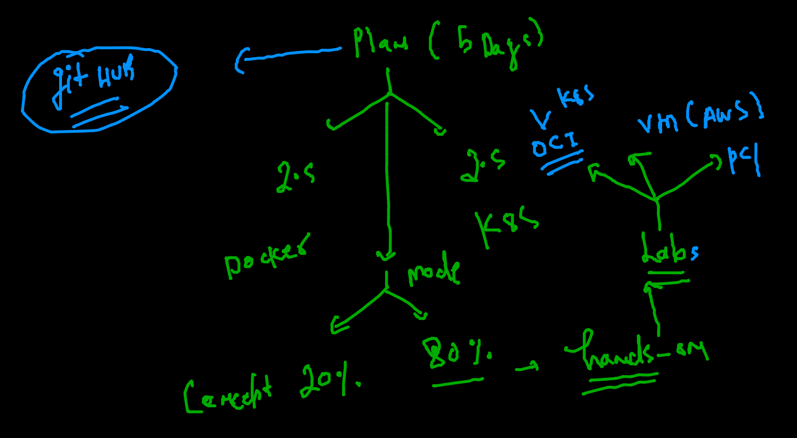

### Revision 

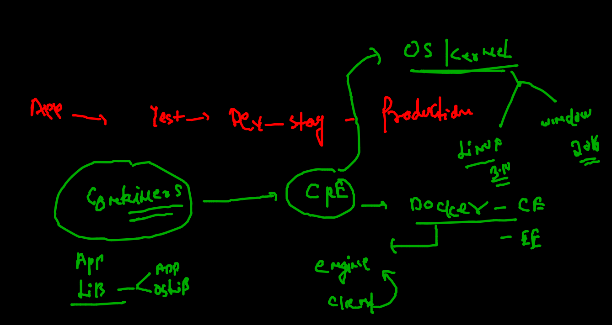

### k8s architecture 

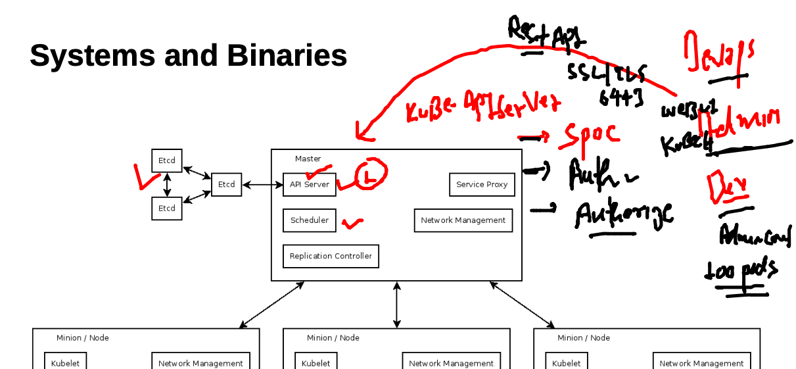

### checking config view and connecting 

```
kubectl  get  no
NAME            STATUS   ROLES                  AGE   VERSION
control-plane   Ready    control-plane,master   24h   v1.22.4
node1           Ready    <none>                 24h   v1.22.4
node2           Ready    <none>                 24h   v1.22.4
 fire@ashutoshhs-MacBook-Air  ~  kubectl  config  view 
apiVersion: v1
clusters:
- cluster:
    certificate-authority-data: DATA+OMITTED
    server: https://54.157.252.113:6443
  name: kubernetes
contexts:
- context:
    cluster: kubernetes
    user: kubernetes-admin
  name: kubernetes-admin@kubernetes
current-context: kubernetes-admin@kubernetes
kind: Config
preferences: {}
users:
- name: kubernetes-admin
  user:
    client-certificate-data: REDACTED
    client-key-data: REDACTED

```

### etcd 

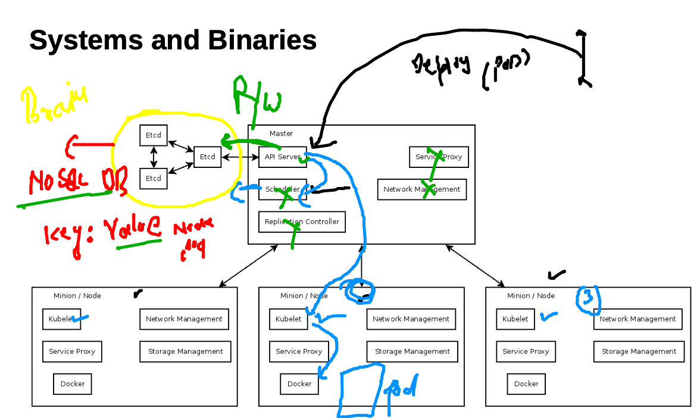

## to Get dashboard access 

### check port number

### check token 

```
 kubectl   get  secret  -n kubernetes-dashboard 
NAME                               TYPE                                  DATA   AGE
default-token-l5zkg                kubernetes.io/service-account-token   3      24h
kubernetes-dashboard-certs         Opaque                                0      24h
kubernetes-dashboard-csrf          Opaque                                1      24h
kubernetes-dashboard-key-holder    Opaque                                2      24h
kubernetes-dashboard-token-ndvgr   kubernetes.io/service-account-token   3      24h


=====

kubectl  describe  secret  kubernetes-dashboard-token-ndvgr    -n kubernetes-dashboard 
Name:         kubernetes-dashboard-token-ndvgr
Namespace:    kubernetes-dashboard
Labels:       <none>
Annotations:  kubernetes.io/service-account.name: kubernetes-dashboard
              kubernetes.io/service-account.uid: b094c064-e3a8-47cc-be71-61c0ea12b072

Type:  kubernetes.io/service-account-token

Data
====
ca.crt:     1099 bytes
namespace:  20 bytes
token:      eyJhbGciOiJSUzI1NiIsImtpZCI6IlBiZUJmQkdmQUI4bHFpelpZZkxzTG9UaEZyNjJPX1AzbWNrTVpKSmlOcTQifQ.eyJpc3MiOiJrdWJlcm5ldGVzL3NlcnZpY2VhY2NvdW50Iiwia3ViZXJuZXRlcy5pby9zZ
```

### generate yaml / JSON output 

```
 7087  kubectl  run  ashupodx1  --image=nginx   --port 80 --dry-run=client -o yaml
 7088  kubectl  run  ashupodx1  --image=nginx   --port 80 --dry-run=client -o json 
```

### yaml file saved 

```
kubectl   run  ashupod3  --image=nginx --port 80 --dry-run=client -o yaml   >nginx.yaml

```

### replacing 

```
 kubectl  replace -f nginx.yaml  --force 
pod "ashupod3" deleted
pod/ashupod3 replaced

```

### namespace in k8s 

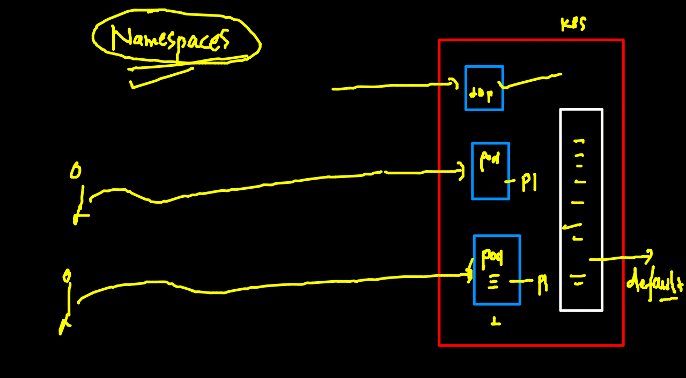

### checking namespace of pod 


### list of namespaces 

```
kubectl   get  namespaces 
NAME                   STATUS   AGE
default                Active   25h
kube-node-lease        Active   25h
kube-public            Active   25h
kube-system            Active   25h
kubernetes-dashboard   Active   25h
 fire@ashutoshhs-MacBook-Air  ~  
 fire@ashutoshhs-MacBook-Air  ~  
 fire@ashutoshhs-MacBook-Air  ~  
 fire@ashutoshhs-MacBook-Air  ~  
 fire@ashutoshhs-MacBook-Air  ~  kubectl   get  ns         
NAME                   STATUS   AGE
default                Active   25h
kube-node-lease        Active   25h
kube-public            Active   25h
kube-system            Active   25h
kubernetes-dashboard   Active   25h

```

### checking pods with different namespace 

```
kubectl  get  po 
No resources found in default namespace.
 fire@ashutoshhs-MacBook-Air  ~  kubectl  get  po   -n  kube-public
No resources found in kube-public namespace.
 fire@ashutoshhs-MacBook-Air  ~  
 fire@ashutoshhs-MacBook-Air  ~  
 fire@ashutoshhs-MacBook-Air  ~  kubectl  get  po   -n  kubernetes-dashboard
NAME                                        READY   STATUS    RESTARTS      AGE
dashboard-metrics-scraper-c45b7869d-hnc8p   1/1     Running   2 (17h ago)   25h
kubernetes-dashboard-576cb95f94-xv78x       1/1     Running   2 (17h ago)   25h

```

### kube-system contains k8s internal components 

```
kubectl  get  po   -n  kube-system
NAME                                       READY   STATUS    RESTARTS      AGE
calico-kube-controllers-56b8f699d9-crgwn   1/1     Running   2 (17h ago)   25h
calico-node-54wxn                          1/1     Running   2 (17h ago)   25h
calico-node-7x46l                          1/1     Running   2 (17h ago)   25h
calico-node-9dnts                          1/1     Running   2 (17h ago)   25h
coredns-78fcd69978-7p8gh                   1/1     Running   2 (17h ago)   25h
coredns-78fcd69978-88lfh                   1/1     Running   2 (17h ago)   25h
etcd-control-plane                         1/1     Running   2 (17h ago)   25h
kube-apiserver-control-plane               1/1     Running   2 (17h ago)   25h
kube-controller-manager-control-plane      1/1     Running   2 (17h ago)   25h
kube-proxy-czq4d                           1/1     Running   2 (17h ago)   25h
kube-proxy-nqrlk                           1/1     Running   2 (17h ago)   25h
kube-proxy-vzztr                           1/1     Running   2 (17h ago)   25h
kube-scheduler-control-plane               1/1     Running   2 (17h ago)   25h
metrics-server-6fb5c69669-ngz66            1/1     Running   2 (17h ago)   25h

```

###  creating namespace 

```
kubectl   create  namespace   ashu-space  
namespace/ashu-space created
 fire@ashutoshhs-MacBook-Air  ~  kubectl  get  ns
NAME                   STATUS   AGE
ashu-space             Active   4s
default                Active   25h
kube-node-lease        Active   25h
kube-public            Active   25h
kube-system            Active   25h
kubernetes-dashboard   Active   25h


```

### setting default namespace 

```
kubectl  config  set-context  --current --namespace=ashu-space 
Context "kubernetes-admin@kubernetes" modified.
 fire@ashutoshhs-MacBook-Air  ~  kubectl  get  pods
No resources found in ashu-space namespace.

```

### checking default namespace 

```
kubectl  config  get-contexts 
CURRENT   NAME                          CLUSTER      AUTHINFO           NAMESPACE
*         kubernetes-admin@kubernetes   kubernetes   kubernetes-admin   ashu-space

```

### deploy pod in different namespace 

```
kubectl apply -f  ashupod1.yaml   -n  default 
pod/ashupod-1 created

```

### YAML with custom changes 

```
apiVersion: v1
kind: Pod
metadata:
  namespace: default # namespace information 
  creationTimestamp: null
  labels:
    run: ashupod3
  name: ashupod3 # name of pod 
spec:
  nodeName: node1 # static scheduling 
  containers:
  - image: nginx # docker image 
    name: ashupod3 # name of container 
    ports: # container app port number 
    - containerPort: 80
    resources: {}
  dnsPolicy: ClusterFirst
  restartPolicy: Always
status: {}


```

### COntainer Networking model 

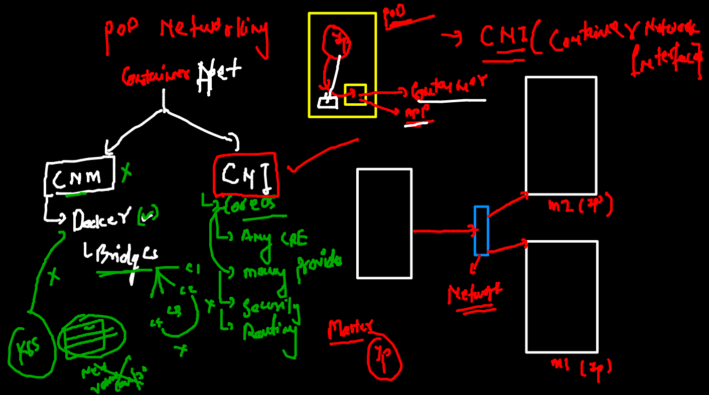

### CNI plugins 

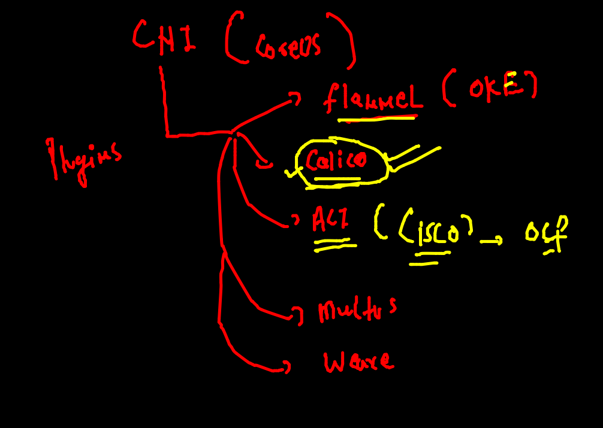

## CNI bridge 

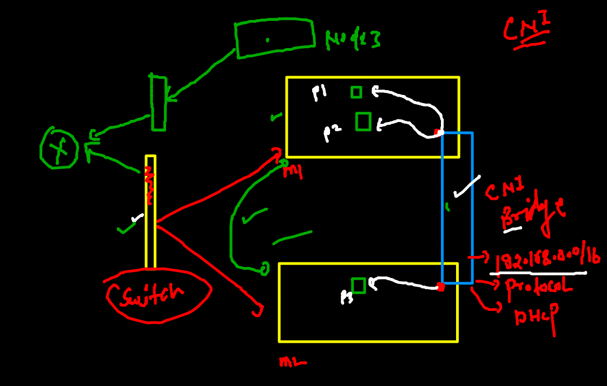

### checking pod IP 

```
kubectl  get  po  -o wide       
NAME        READY   STATUS    RESTARTS   AGE   IP               NODE    NOMINATED NODE   READINESS GATES
ashupod-1   1/1     Running   0          74m   192.168.104.54   node2   <none>           <none>
 fire@ashutoshhs-MacBook-Air  ~  kubectl describe  po   ashupod-1
Name:         ashupod-1
Namespace:    ashu-space
Priority:     0
Node:         node2/172.31.93.71
Start Time:   Thu, 25 Nov 2021 11:11:59 +0530
Labels:       <none>
Annotations:  cni.projectcalico.org/containerID: 4023c10f42dc900d3d739d9f679ba5456bef7ffc0c25fd757980298f1d2938e3
              cni.projectcalico.org/podIP: 192.168.104.54/32
              cni.projectcalico.org/podIPs: 192.168.104.54/32
Status:       Running
IP:           192.168.104.54


```

### POD from different namespace can connect by default 


```
 kubectl  exec -it   ashutoshhpod1 -n tasks  -- sh 
/ # 
/ # ping  192.168.104.54
PING 192.168.104.54 (192.168.104.54): 56 data bytes
64 bytes from 192.168.104.54: seq=0 ttl=254 time=0.124 ms
64 bytes from 192.168.104.54: seq=1 ttl=254 time=0.127 ms
64 bytes from 192.168.104.54: seq=2 ttl=254 time=0.123 ms
^C
--- 192.168.104.54 ping statistics ---
3 packets transmitted, 3 packets received, 0% packet loss
round-trip min/avg/max = 0.123/0.124/0.127 ms
/ # exit

```

### webapp in POD 

```
 kubectl   run  ashuweb  --image=dockerashu/orwebapp:v007  --port 80  --dry-run=client -o yaml  >orwebapp.yaml
 
 kubectl  apply -f  orwebapp.yaml 
 
 kubectl   get  po 
NAME      READY   STATUS    RESTARTS   AGE
ashuweb   1/1     Running   0          37s
[ashu@ip-172-31-80-220 webapp1]$ kubectl   get  po  -o wide
NAME      READY   STATUS    RESTARTS   AGE   IP                NODE    NOMINATED NODE   READINESS GATES
ashuweb   1/1     Running   0          41s   192.168.166.136   node1   <none>           <none>

```

### case 1. k8s clients 

```
 kubectl  port-forward  ashuweb  1122:80 
 
```

### Demo 

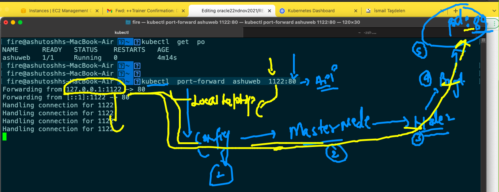

### we need Internal LB for apps having multiple POds 

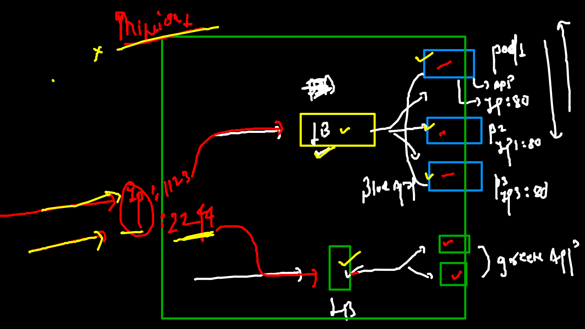

### SErvice Intro 

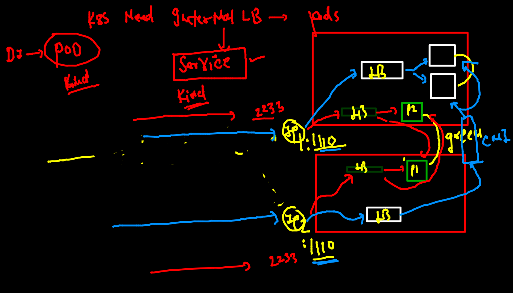

### k8s Internal LB -- usage --of POD to connect

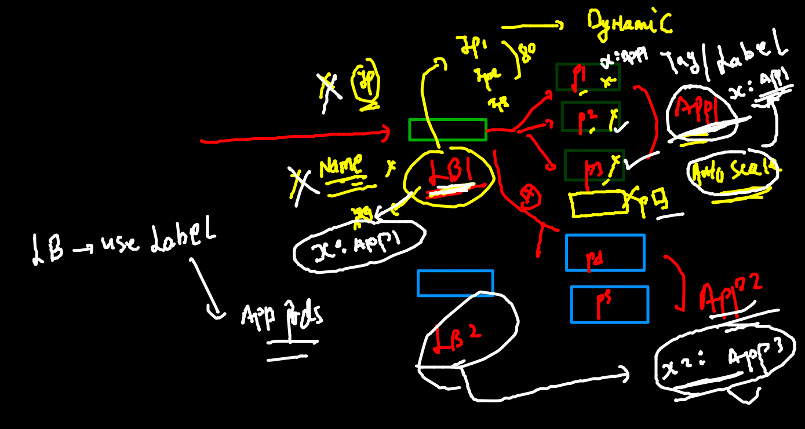

### checking label of running pod 

```
kubectl  get  po
NAME      READY   STATUS    RESTARTS   AGE
ashuweb   1/1     Running   0          124m
 fire@ashutoshhs-MacBook-Air  ~  kubectl  get  po --show-labels
NAME      READY   STATUS    RESTARTS   AGE    LABELS
ashuweb   1/1     Running   0          124m   x1=helloashu

```

### service type in k8s 

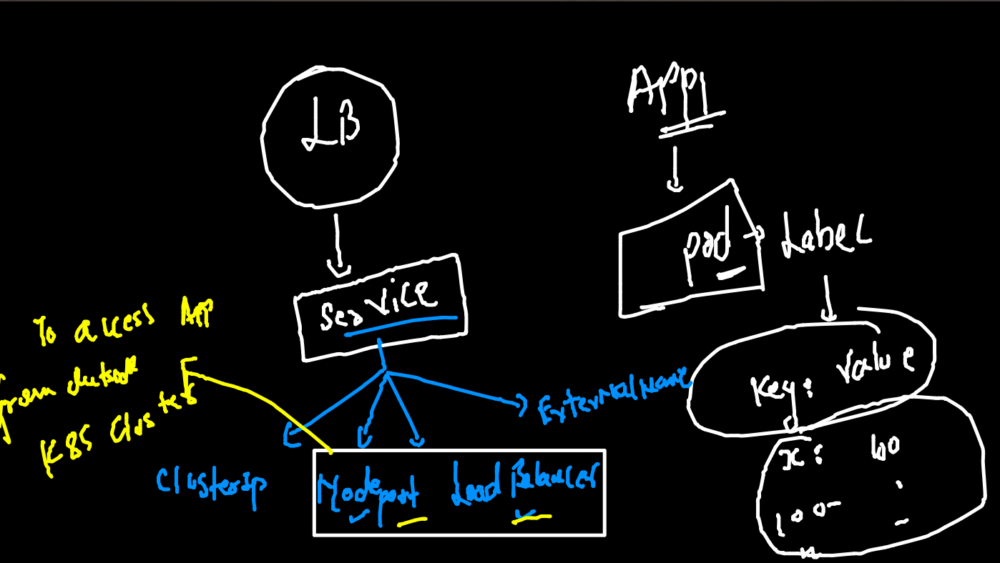

### nodeport type service 

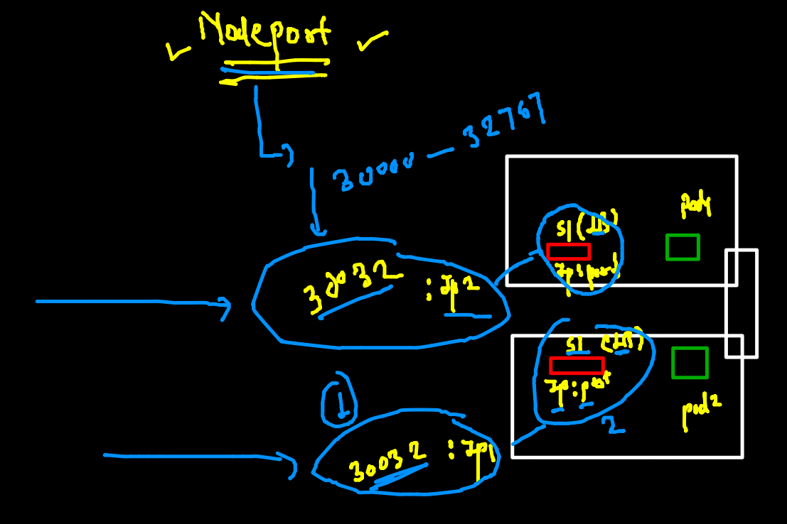

### creating nodeport service type yaml 

```
kubectl   create  service 
Create a service using a specified subcommand.

Aliases:
service, svc

Available Commands:
  clusterip    Create a ClusterIP service
  externalname Create an ExternalName service
  loadbalancer Create a LoadBalancer service
  nodeport     Create a NodePort service

Usage:
  kubectl create service [flags] [options]

Use "kubectl <command> --help" for more information about a given command.
Use "kubectl options" for a list of global command-line options (applies to all commands).
[ashu@ip-172-31-80-220 appimages]$ kubectl   create  service  nodeport  ashusvc1  --tcp  1234:80  --dry-run=client  -o yaml  >ashusvc.yaml 
```


### service nodeport after selector modification 

```
apiVersion: v1
kind: Service
metadata:
  creationTimestamp: null
  labels:
    app: ashusvc1
  name: ashusvc1 # name of service 
spec:
  ports:
  - name: 1234-80
    port: 1234 # service IP port number 
    protocol: TCP
    targetPort: 80 # app port which is running in a pod 
  selector: # POd finder using label of pod 
    x1: helloashu # this is label of POD 
  type: NodePort # type of service 
status:
  loadBalancer: {}


```

### deploy service 

```
 kubectl  apply -f  ashusvc.yaml 
service/ashusvc1 created
[ashu@ip-172-31-80-220 appimages]$ kubectl   get  svc
NAME       TYPE       CLUSTER-IP     EXTERNAL-IP   PORT(S)          AGE
ashusvc1   NodePort   10.97.31.169   <none>        1234:30633/TCP   6s

```

### nodeport svc verification 

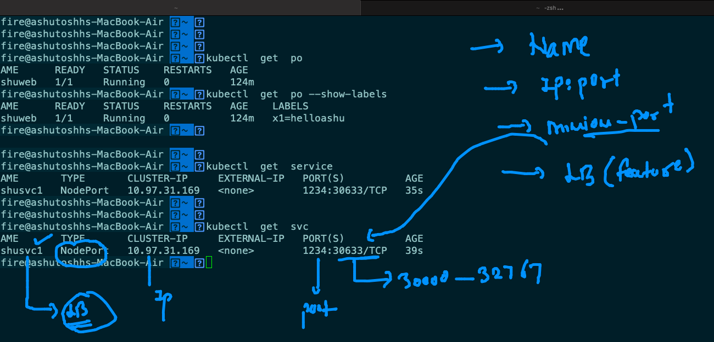

### chekcing lable and selector 

```
kubectl  get  po --show-labels 
NAME      READY   STATUS    RESTARTS   AGE    LABELS
ashuweb   1/1     Running   0          155m   x1=helloashu
 fire@ashutoshhs-MacBook-Air  ~  
 fire@ashutoshhs-MacBook-Air  ~  
 fire@ashutoshhs-MacBook-Air  ~  
 fire@ashutoshhs-MacBook-Air  ~  kubectl  get  svc
NAME       TYPE       CLUSTER-IP     EXTERNAL-IP   PORT(S)          AGE
ashusvc1   NodePort   10.97.31.169   <none>        1234:30633/TCP   7m22s
 fire@ashutoshhs-MacBook-Air  ~  kubectl  get  svc -o wide
NAME       TYPE       CLUSTER-IP     EXTERNAL-IP   PORT(S)          AGE     SELECTOR
ashusvc1   NodePort   10.97.31.169   <none>        1234:30633/TCP   7m29s   x1=helloashu


```

### getting all data in your namespace 


```
 kubectl   get   po,svc
NAME          READY   STATUS    RESTARTS   AGE
pod/ashuweb   1/1     Running   0          165m

NAME               TYPE       CLUSTER-IP     EXTERNAL-IP   PORT(S)          AGE
service/ashusvc1   NodePort   10.97.31.169   <none>        1234:30633/TCP   17m
[ashu@ip-172-31-80-220 appimages]$ 
[ashu@ip-172-31-80-220 appimages]$ kubectl   get  all
NAME          READY   STATUS    RESTARTS   AGE
pod/ashuweb   1/1     Running   0          165m

NAME               TYPE       CLUSTER-IP     EXTERNAL-IP   PORT(S)          AGE
service/ashusvc1   NodePort   10.97.31.169   <none>        1234:30633/TCP   18m

```
### Merging pod and svc YAML in a same file 

```
apiVersion: v1
kind: Pod
metadata:
  creationTimestamp: null
  labels: # label of POD can be changed in run time and after that also
    x1: helloashu # key and value pair 
  name: ashuweb # name of pod 
spec:
  containers:
  - image: dockerashu/orwebapp:v007 # docker hub image 
    name: ashuweb # name of POD 
    ports: # app port 
    - containerPort: 80
    resources: {}
  dnsPolicy: ClusterFirst
  restartPolicy: Always
status: {}

---

apiVersion: v1
kind: Service
metadata:
  creationTimestamp: null
  labels:
    app: ashusvc1
  name: ashusvc1 # name of service 
spec:
  ports:
  - name: 1234-80
    port: 1234 # service IP port number 
    protocol: TCP
    targetPort: 80 # app port which is running in a pod 
  selector: # POd finder using label of pod 
    x1: helloashu # this is label of POD 
  type: NodePort # type of service 
status:
  loadBalancer: {}


```


### Deploy 

```
 kubectl  apply -f  finalapp.yaml 
pod/ashuweb created
service/ashusvc1 created
[ashu@ip-172-31-80-220 k8sapps]$ kubectl  get po --show-labels 
NAME      READY   STATUS    RESTARTS   AGE   LABELS
ashuweb   1/1     Running   0          9s    x1=helloashu
[ashu@ip-172-31-80-220 k8sapps]$ 
[ashu@ip-172-31-80-220 k8sapps]$ kubectl  get svc  -o wide
NAME       TYPE       CLUSTER-IP      EXTERNAL-IP   PORT(S)          AGE   SELECTOR
ashusvc1   NodePort   10.110.25.156   <none>        1234:32173/TCP   16s   x1=helloashu
[ashu@ip-172-31-80-220 k8sapps]$ 

```
### task 2 solution 

#### YAML 

```
apiVersion: v1
kind: Namespace
metadata:
  creationTimestamp: null
  name: ashuk8s1
spec: {}
status: {}
---
apiVersion: v1
kind: Pod
metadata:
  creationTimestamp: null
  labels:
    run: ashupod
  name: ashupod
  namespace: ashuk8s1
spec:
  containers:
  - image: ubuntu
    name: ashupod
    command: ["bash","-c","sleep 10000"]
    resources: {}
  dnsPolicy: ClusterFirst
  restartPolicy: Always
status: {}
---
apiVersion: v1
kind: Service
metadata:
  creationTimestamp: null
  labels:
    app: ashusvc1
  name: ashusvc1
  namespace: ashuk8s1
spec:
  ports:
  - name: 1233-80
    port: 1233
    protocol: TCP
    targetPort: 80
    nodePort: 31002 # settting static port number 
  selector:
    app: ashusvc1
  type: NodePort
status:
  loadBalancer: {}

```

### commands 

```
603  kubectl   create   namespace  ashuk8s1 --dry-run=client -o yaml 
  604  kubectl   create   namespace  ashuk8s1 --dry-run=client -o yaml  >task2.yaml 
  605  kubectl   run  ashupod  --image=ubuntu --namespace=ashuk8s1  --dry-run=client  -o yaml 
  606  kubectl  apply -f  task2.yaml 
  607  kubectl   get po -n ashuk8s 
  608  kubectl   get po -n ashuk8s1 
  609  kubectl   create  service  nodeport ashusvc1 --tcp 1233:80  --namespace=ashuk8s1  --dry-run=client -o yaml 
  610  ls
  611  kubectl apply -f  task2.yaml 
  612  kubectl  get  svc -n ashuk8s1 
  613  kubectl  get  all -n ashuk8s1 
  614  ls
  615  kubectl  cp  logs.txt   ashupod:/tmp/ -n ashuk8s1 

```

### REPlication controller 

```
apiVersion: v1
kind: ReplicationController
metadata:
 name: ashurc-1 
spec:
 replicas: 1 # number of POD to be created 
 template: # put pod template 
  metadata:
   labels: # label of pod 
    x1: helloashuapp
  spec:
   containers:
   - image: dockerashu/orwebapp:v007
     name: ashuc1
     ports:
     - containerPort: 80 
     
```

###  Deploy 

```
kubectl apply -f  ashurc1.yaml 
replicationcontroller/ashurc-1 created
[ashu@ip-172-31-80-220 k8sapps]$ kubectl  get  rc
NAME       DESIRED   CURRENT   READY   AGE
ashurc-1   1         1         1       4s
[ashu@ip-172-31-80-220 k8sapps]$ kubectl  get  pod
NAME             READY   STATUS    RESTARTS   AGE
ashurc-1-w8f4m   1/1     Running   0          10s

```

### self healing 

```
 kubectl  delete pod ashurc-1-w8f4m
pod "ashurc-1-w8f4m" deleted
[ashu@ip-172-31-80-220 k8sapps]$ kubectl  get  pod
NAME             READY   STATUS    RESTARTS   AGE
ashurc-1-js5x7   1/1     Running   0          4s


```

### creating service using expose 

```

[ashu@ip-172-31-80-220 k8sapps]$ kubectl  get   rc
NAME       DESIRED   CURRENT   READY   AGE
ashurc-1   1         1         1       4m18s
[ashu@ip-172-31-80-220 k8sapps]$ kubectl  get   po --show-labels
NAME             READY   STATUS    RESTARTS   AGE     LABELS
ashurc-1-js5x7   1/1     Running   0          3m35s   x1=helloashuapp
[ashu@ip-172-31-80-220 k8sapps]$ 
[ashu@ip-172-31-80-220 k8sapps]$ 
[ashu@ip-172-31-80-220 k8sapps]$ kubectl  expose  rc  ashurc-1  --type NodePort --port 80 --name ashusvc2
service/ashusvc2 exposed
[ashu@ip-172-31-80-220 k8sapps]$ kubectl   get  svc -o wide 
NAME       TYPE       CLUSTER-IP      EXTERNAL-IP   PORT(S)        AGE   SELECTOR
ashusvc2   NodePort   10.101.96.250   <none>        80:30154/TCP   13s   x1=helloashuapp
```

### scaling POD via RC 

```
kubectl scale  rc  ashurc-1  --replicas=3
replicationcontroller/ashurc-1 scaled
[ashu@ip-172-31-80-220 k8sapps]$ 
[ashu@ip-172-31-80-220 k8sapps]$ kubectl    get  po 
NAME             READY   STATUS    RESTARTS   AGE
ashurc-1-js5x7   1/1     Running   0          16m
ashurc-1-nf2j8   1/1     Running   0          4s
ashurc-1-x2wpw   1/1     Running   0          4s
[ashu@ip-172-31-80-220 k8sapps]$ kubectl    get  po  -o wide
NAME             READY   STATUS    RESTARTS   AGE   IP                NODE    NOMINATED NODE   READINESS GATES
ashurc-1-js5x7   1/1     Running   0          16m   192.168.166.186   node1   <none>           <none>
ashurc-1-nf2j8   1/1     Running   0          17s   192.168.104.1     node2   <none>           <none>
ashurc-1-x2wpw   1/1     Running   0          17s   192.168.104.62    node2   <none>           <none>

```

### Deploy app in k8s from private Registry 

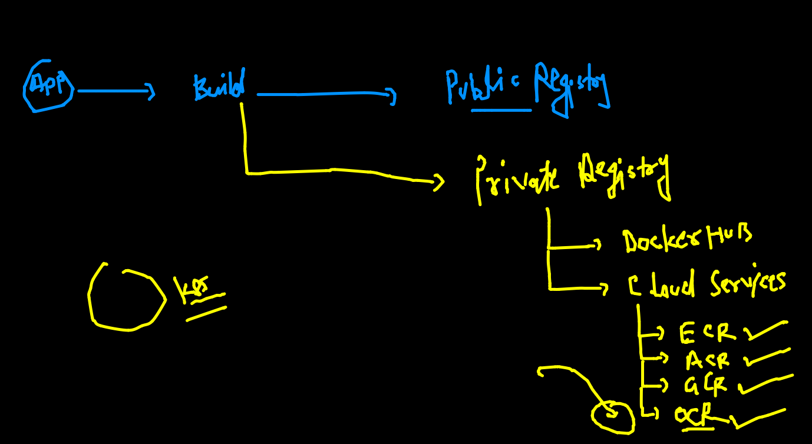

### Pushing image to OCR 

```
 644  docker  tag  247bf4bc2225   phx.ocir.io/axmbtg8judkl/mywebapp:v1 
  645  docker  images
  646  docker  login  phx.ocir.io 
  647  docker  login  phx.ocir.io  
  648  docker  push phx.ocir.io/axmbtg8judkl/mywebapp:v1
  649  history 
  650  docker  logout   phx.ocir.io  
  
```


