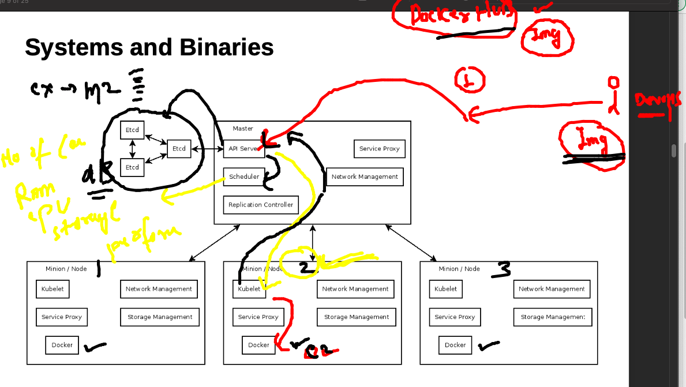
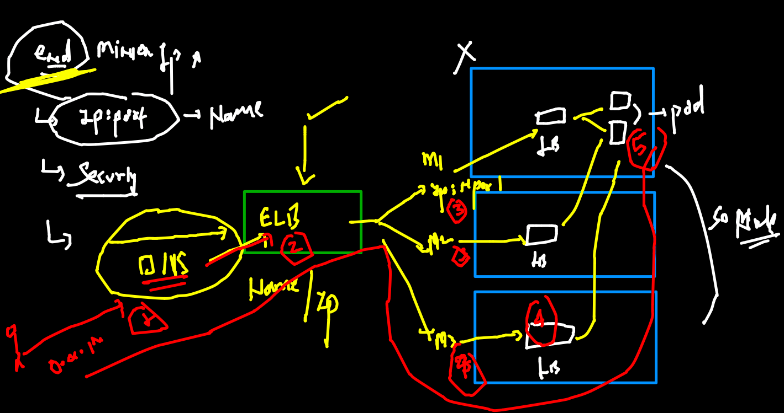
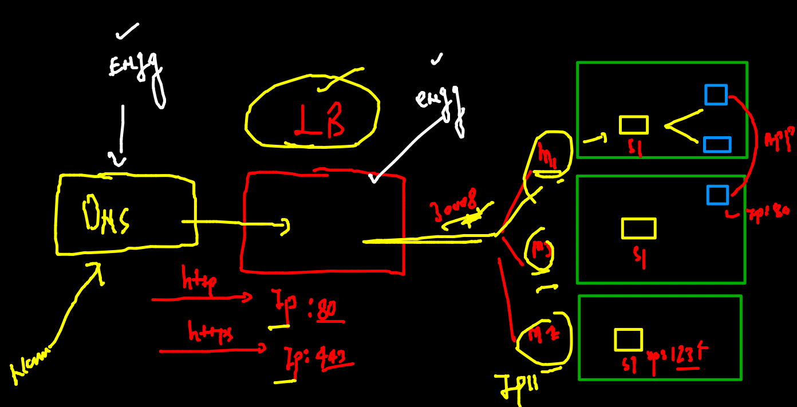
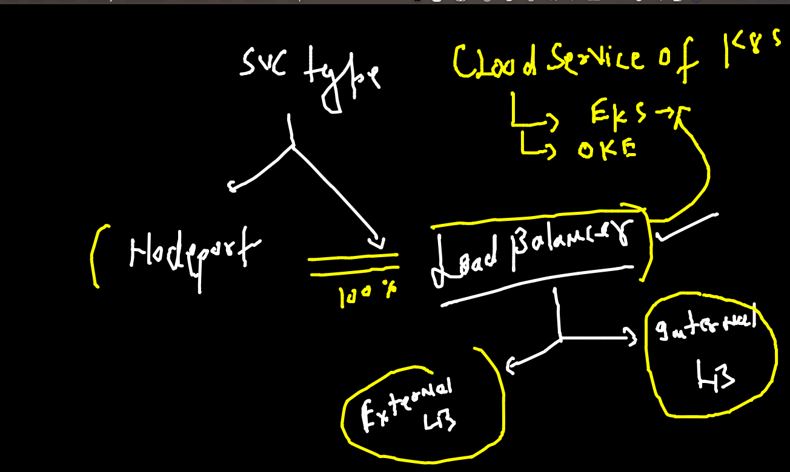
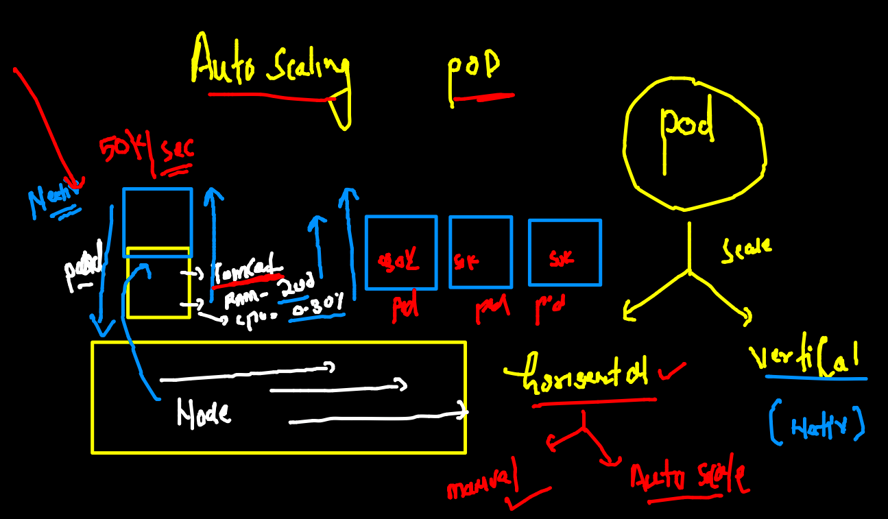
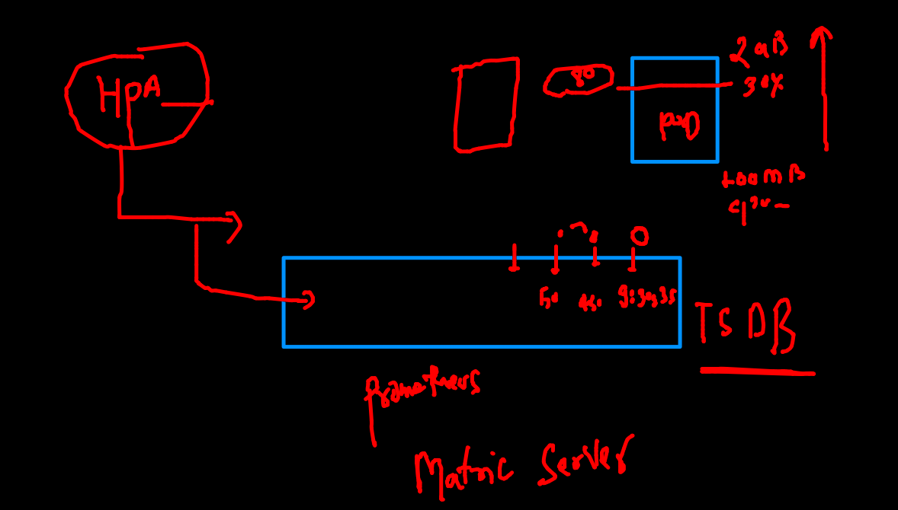
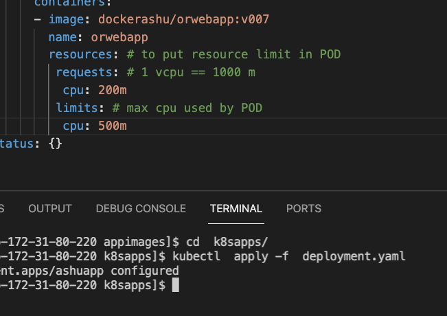

# Training Plan 


## java spring boot app containerization 

### Multi stage dockerfile comes in picture


### multistage docker 

```
FROM oraclelinux:8.3  as Builder
LABEL "name"="ashutoshh"
RUN dnf install java-1.8.0-openjdk.x86_64 java-1.8.0-openjdk-devel.x86_64  -y
RUN dnf install maven -y
RUN mkdir /javawebapp
WORKDIR /javawebapp
COPY . . 
# to build project into war file -- /javawebapp/target/WebApp.war 
RUN mvn clean package


FROM tomcat 
MAINTAINER ashutoshh@linux.com
COPY  --from=Builder  /javawebapp/target/WebApp.war   /usr/local/tomcat/webapps/
EXPOSE 8080
# ENtrypoint and CMD if we are not using it will be inherited from original image
```

### build image 

```
docker  build -t javaspringboot:v1 . 
Sending build context to Docker daemon  14.85kB
Step 1/12 : FROM oraclelinux:8.3  as Builder
8.3: Pulling from library/oraclelinux
dd34f38d274c: Pull complete 
Digest: sha256:af3182ee6c1e56f18fc1fecaf638da57d7c47233862e5c32f5ad723a6ab4c6db
Status: Downloaded newer image for oraclelinux:8.3
 ---> 816d99f0bbe8
Step 2/12 : LABEL "name"="ashutoshh"
 ---> Running in bd9a4f37e7f4
Removing intermediate container bd9a4f37e7f4
 ---> 64de39c943ab
Step 3/12 : RUN dnf install java-1.8.0-openjdk.x86_64

```

### pushing image to docker hub and OCR 

```
  docker  tag  javaspringboot:v1  dockerashu/javaspringboot:v1
  676  docker login 
  677  docker push dockerashu/javaspringboot:v1
  678  history 
  679  docker  tag  javaspringboot:v1  phx.ocir.io/axmbtg8judkl/javaspringboot:v1
  680  history 
  681  docker  login phx.ocir.io -u  axmbtg8judkl/learntechbyme@gmail.com
  682  history 
[ashu@ip-172-31-80-220 java-springboot]$ docker push phx.ocir.io/axmbtg8judkl/javaspringboot:v1
The push refers to repository [phx.ocir.io/axmbtg8judkl/javaspringboot]
c6f27dcb49ad: Pushed 
cf0d7f22bbdc: Pushed 
f2d212e4d5ab: Pushed 
b87b38d56cd3: Pushed 
a9e4c9343539: Pushing  278.6MB/342.7MB
47ee2d19f81a: Pushed 
ab9d251e27cb: Pushed 
8a5844586fdb: Pushed 

```

### checking k8s connection and remove data 
```
kubectl  get  no
NAME            STATUS   ROLES                  AGE    VERSION
control-plane   Ready    control-plane,master   2d1h   v1.22.4
node1           Ready    <none>                 2d1h   v1.22.4
node2           Ready    <none>                 2d1h   v1.22.4
 fire@ashutoshhs-MacBook-Air  ~  
 fire@ashutoshhs-MacBook-Air  ~  kubectl config get-contexts 
CURRENT   NAME                          CLUSTER      AUTHINFO           NAMESPACE
*         kubernetes-admin@kubernetes   kubernetes   kubernetes-admin   ashu-space
 fire@ashutoshhs-MacBook-Air  ~  
 fire@ashutoshhs-MacBook-Air  ~  kubectl  get  all
NAME                 READY   STATUS             RESTARTS   AGE
pod/ashurc-1-5z7fw   0/1     ImagePullBackOff   0          17h

NAME                             DESIRED   CURRENT   READY   AGE
replicationcontroller/ashurc-1   1         1         0       17h

NAME               TYPE       CLUSTER-IP      EXTERNAL-IP   PORT(S)        AGE
service/ashusvc2   NodePort   10.101.96.250   <none>        80:30154/TCP   17h
 fire@ashutoshhs-MacBook-Air  ~  kubectl  delete all --all
pod "ashurc-1-5z7fw" deleted
replicationcontroller "ashurc-1" deleted
service "ashusvc2" deleted

```

### creating YAML 

```
apiVersion: v1
kind: ReplicationController
metadata:
 name: ashurc-1 
spec:
 replicas: 1 # number of POD to be created 
 template: # put pod template 
  metadata:
   labels: # label of pod 
    x1: helloashuapp
  spec:
   containers:
   - image: dockerashu/javaspringboot:v1 # image from Docker hUb 
     name: ashuc1
     ports:
     - containerPort: 80 
# service of nodeport type also 
---
apiVersion: v1
kind: Service
metadata:
  creationTimestamp: null
  labels:
    app: ashutomcatapp
  name: ashutomcatapp # name of service 
spec:
  ports:
  - name: 1234-8080
    port: 1234
    protocol: TCP
    targetPort: 8080
  selector: # POd finder 
    x1: helloashuapp # exactly same label 
  type: NodePort
status:
  loadBalancer: {}


```


### Deploying yaml 

```
 cd k8sapps/
[ashu@ip-172-31-80-220 k8sapps]$ ls
ashupod1.yaml  finalapp.yaml  nginx.json  task1.yaml  tomcatrc.yaml
ashurc1.yaml   logs.txt       nginx.yaml  task2.yaml
[ashu@ip-172-31-80-220 k8sapps]$ kubectl apply -f tomcatrc.yaml 
replicationcontroller/ashurc-1 created
service/ashutomcatapp created
[ashu@ip-172-31-80-220 k8sapps]$ kubectl   g et  rc
NAME       DESIRED   CURRENT   READY   AGE
ashurc-1   1         1         0       9s
[ashu@ip-172-31-80-220 k8sapps]$ kubectl   get  svc 
NAME            TYPE       CLUSTER-IP       EXTERNAL-IP   PORT(S)          AGE
ashutomcatapp   NodePort   10.108.250.161   <none>        1234:32581/TCP   14s

```

###  scale 

```
kubectl  scale rc  ashurc-1  --replicas=5
replicationcontroller/ashurc-1 scaled
 fire@ashutoshhs-MacBook-Air  ~  kubectl  get  po 
NAME             READY   STATUS    RESTARTS   AGE
ashurc-1-2kg4p   1/1     Running   0          4s
ashurc-1-8zjln   1/1     Running   0          4s
ashurc-1-g8lvt   1/1     Running   0          4s
ashurc-1-kl2tj   1/1     Running   0          5m53s
ashurc-1-sbd8f   1/1     Running   0          4s

```

### Understnading pulling image from OCR 


### secret in k8s 


### creating secret 

```
kubectl  create  secret  
Create a secret using specified subcommand.

Available Commands:
  docker-registry Create a secret for use with a Docker registry
  generic         Create a secret from a local file, directory, or literal value
  tls             Create a TLS secret

Usage:
  kubectl create secret [flags] [options]


====


```

### 

```
kubectl  create  secret   docker-registry  ashusec1 --docker-server=phx.ocir.io  --docker-username="axmbtkl/learn@gmail.com"    --docker-password="T0mAJUzS[YdOK"

```

### after adding secret in YAML 

```
kubectl  replace -f  tomcatrc.yaml --force 
replicationcontroller "ashurc-1" deleted
service "ashutomcatapp" deleted
replicationcontroller/ashurc-1 replaced
service/ashutomcatapp replaced
[ashu@ip-172-31-80-220 k8sapps]$ kubectl   get  rc 
NAME       DESIRED   CURRENT   READY   AGE
ashurc-1   1         1         1       14s
[ashu@ip-172-31-80-220 k8sapps]$ kubectl   get  po
NAME             READY   STATUS    RESTARTS   AGE
ashurc-1-dxvfp   1/1     Running   0          24s

```

### deployment api resource type 



### creating deployment 

```
kubectl  create  deployment  ashuapp --image=dockerashu/orwebapp:v007   --dry-run=client -o yaml  >deployment.yaml

```

#### 

```
$ kubectl   get  deployments 
NAME      READY   UP-TO-DATE   AVAILABLE   AGE
ashuapp   1/1     1            1           2m36s
[ashu@ip-172-31-80-220 k8sapps]$ kubectl   get  deploy
NAME      READY   UP-TO-DATE   AVAILABLE   AGE
ashuapp   1/1     1            1           2m41s
[ashu@ip-172-31-80-220 k8sapps]$ 
[ashu@ip-172-31-80-220 k8sapps]$ kubectl  get  pods
NAME                       READY   STATUS    RESTARTS   AGE
ashuapp-748b47f987-hz444   1/1     Running   0          2m45s
[ashu@ip-172-31-80-220 k8sapps]$ kubectl  expose deployment  ashuapp  --type NodePort --port 80 --name  hellosvc1 
service/hellosvc1 exposed


```

### manual scaling 

```
kubectl  scale deploy  ashuapp  --replicas=3
deployment.apps/ashuapp scaled
[ashu@ip-172-31-80-220 k8sapps]$ 
[ashu@ip-172-31-80-220 k8sapps]$ kubectl  get  deploy
NAME      READY   UP-TO-DATE   AVAILABLE   AGE
ashuapp   3/3     3            3           6m43s
[ashu@ip-172-31-80-220 k8sapps]$ kubectl  get  po
NAME                       READY   STATUS    RESTARTS   AGE
ashuapp-748b47f987-hz444   1/1     Running   0          6m47s
ashuapp-748b47f987-s2z8d   1/1     Running   0          7s
ashuapp-748b47f987-vbmp8   1/1     Running   0          7s

```

### DNS + LB 



### end user to pod access 



### Loadbalancer service 



```
 kubectl  expose deploy  ashuapp  --type LoadBalancer --port 80 --name lbsvc  
service/lbsvc exposed
[ashu@ip-172-31-80-220 k8sapps]$ kubectl   get  svc 
NAME        TYPE           CLUSTER-IP       EXTERNAL-IP   PORT(S)        AGE
hellosvc1   NodePort       10.100.213.193   <none>        80:31361/TCP   37m
lbsvc       LoadBalancer   10.107.112.58    <pending>     80:30568/TCP   4s

```

### scaling in POD 



### HPA {Horizental pod auto scaler }



### putting resource limit in POD 



### Deployment YAML 

```
apiVersion: apps/v1
kind: Deployment
metadata:
  creationTimestamp: null
  labels:
    app: ashuapp
  name: ashuapp # name of deployment 
spec: 
  replicas: 1 # no of pod 
  selector:
    matchLabels:
      app: ashuapp
  strategy: {}
  template: # to create pod we need template 
    metadata:
      creationTimestamp: null
      labels:
        app: ashuapp
    spec:
      containers:
      - image: dockerashu/orwebapp:v007
        name: orwebapp
        resources: # to put resource limit in POD 
         requests: # 1 vcpu == 1000 m 
          cpu: 200m
         limits: # max cpu used by POD 
          cpu: 500m 
status: {}

```

### autoscale rule 

```
kubectl  autoscale  deployment  ashuapp --min=3  --max=20 --cpu-percent=80
horizontalpodautoscaler.autoscaling/ashuapp autoscaled
 fire@ashutoshhs-MacBook-Air  ~  
 fire@ashutoshhs-MacBook-Air  ~  kubectl  get  hpa
NAME      REFERENCE            TARGETS         MINPODS   MAXPODS   REPLICAS   AGE
ashuapp   Deployment/ashuapp   <unknown>/80%   3         20        0          5s
 fire@ashutoshhs-MacBook-Air  ~  kubectl  get  deploy 
NAME      READY   UP-TO-DATE   AVAILABLE   AGE
ashuapp   1/3     3            1           8m6s
 fire@ashutoshhs-MacBook-Air  ~  kubectl  get  po 
NAME                      READY   STATUS    RESTARTS   AGE
ashuapp-dbb48df49-8nwnv   1/1     Running   0          8s
ashuapp-dbb48df49-8zkjb   1/1     Running   0          8s
ashuapp-dbb48df49-z8xv9   1/1     Running   0          2m24s

```

### two tier app 

### tier 1 is DB with Storage 

### creating DB yaml 


```
kubectl   create  deployment  ashudb --image=mysql:5.6 --dry-run=client -o yaml 

====

kubectl  create secret  generic  ashudbsec  --from-literal  slqpass=Oracletr099 --dry-run=client -o yaml 
apiVersion: v1
data:
  slqpass: T3JhY2xldHIwOTk=
kind: Secret
metadata:
  creationTimestamp: null
  name: ashudbsec

```

### DB YAML 

```
apiVersion: apps/v1
kind: Deployment
metadata:
  creationTimestamp: null
  labels:
    app: ashudb
  name: ashudb # name of deployment 
spec:
  replicas: 1 # number of DB pods 
  selector:
    matchLabels:
      app: ashudb
  strategy: {}
  template: # template to create DB POD 
    metadata:
      creationTimestamp: null
      labels: # label of pod 
        app: ashudb
    spec:
      volumes: # to create volume 
      - name: ashudbvol
        hostPath: # taking storage from Minion Node 
         path: /ashudata
         type: DirectoryOrCreate 
      containers:
      - image: mysql:5.6
        name: mysql
        env: # set / create ENV variable in POD 
        - name: MYSQL_ROOT_PASSWORD 
          valueFrom: # calling value 
           secretKeyRef: # from secret 
            name: ashudbsec # name of secret 
            key: sqlpass  # key of secret 
        volumeMounts: # to mount storage we created above 
        - name: ashudbvol
          mountPath: /var/lib/mysql/ 
        resources: {}
status: {}
# creating secret 
---
apiVersion: v1
data:
  sqlpass: T3JhY2xldHIwOTk=
kind: Secret
metadata:
  creationTimestamp: null
  name: ashudbsec
  
```
 ### after deployment of DB yaml 

### creating service of clusterIP type 

```
kubectl  expose deployment  ashudb --type ClusterIP --port 3306 --dry-run=client -o yaml 
apiVersion: v1
kind: Service
metadata:
  creationTimestamp: null
  labels:
    app: ashudb
  name: ashudb


```

### serivce deploy 

```
$ kubectl  get  deploy 
NAME     READY   UP-TO-DATE   AVAILABLE   AGE
ashudb   1/1     1            1           16m
[ashu@ip-172-31-80-220 k8sapps]$ kubectl  get  po
NAME                      READY   STATUS    RESTARTS   AGE
ashudb-6c75f6bfdf-k7qh8   1/1     Running   0          16m
[ashu@ip-172-31-80-220 k8sapps]$ kubectl  get  svc
NAME     TYPE        CLUSTER-IP       EXTERNAL-IP   PORT(S)    AGE
ashudb   ClusterIP   10.108.122.238   <none>        3306/TCP   19s
[ashu@ip-172-31-80-220 k8sapps]$ 

```

### webapp YAML content 

```
apiVersion: apps/v1
kind: Deployment
metadata:
  creationTimestamp: null
  labels:
    app: ashuwebapp
  name: ashuwebapp
spec:
  replicas: 1
  selector:
    matchLabels:
      app: ashuwebapp
  strategy: {}
  template:
    metadata:
      creationTimestamp: null
      labels:
        app: ashuwebapp
    spec:
      containers:
      - image: wordpress:4.8-apache
        name: wordpress
        resources: {}
status: {}


```

### deploy 

```
kubectl apply -f  multitierapp.yaml 
deployment.apps/ashudb configured
secret/ashudbsec configured
service/ashudb configured
deployment.apps/ashuwebapp created
[ashu@ip-172-31-80-220 k8sapps]$ kubectl   get  deploy 
NAME         READY   UP-TO-DATE   AVAILABLE   AGE
ashudb       1/1     1            1           52m
ashuwebapp   1/1     1            1           15s
[ashu@ip-172-31-80-220 k8sapps]$ kubectl   get  po 
NAME                          READY   STATUS    RESTARTS   AGE
ashudb-6c75f6bfdf-k7qh8       1/1     Running   0          52m
ashuwebapp-7f5bf75f88-86cdf   1/1     Running   0          23s

```
### creating nodeport or LB service for WEbapp

```
kubectl  expose deployment  ashuwebapp  --type NodePort --port 80 --dry-run=client -o yaml 
apiVersion: v1
kind: Service
metadata:
  creationTimestamp: null
  labels:
    app: ashuwebapp
  name: ashuwebapp
spec:
  ports:
  - port: 80
    protocol: TCP
    targetPort: 80
  selector:
    app: ashuwebapp
  type: NodePort
status:
  loadBalancer: {}


```

### deploy again 

```
kubectl apply -f  multitierapp.yaml 
deployment.apps/ashudb configured
secret/ashudbsec configured
service/ashudb configured
deployment.apps/ashuwebapp configured
service/ashuwebapp created

```

### FInal app yaml 

```
apiVersion: apps/v1
kind: Deployment
metadata:
  creationTimestamp: null
  labels:
    app: ashudb
  name: ashudb # name of deployment 
spec:
  replicas: 1 # number of DB pods 
  selector:
    matchLabels:
      app: ashudb
  strategy: {}
  template: # template to create DB POD 
    metadata:
      creationTimestamp: null
      labels: # label of pod 
        app: ashudb
    spec:
      volumes: # to create volume 
      - name: ashudbvol
        hostPath: # taking storage from Minion Node 
         path: /ashudata
         type: DirectoryOrCreate 
      containers:
      - image: mysql:5.6
        name: mysql
        env: # set / create ENV variable in POD 
        - name: MYSQL_ROOT_PASSWORD 
          valueFrom: # calling value 
           secretKeyRef: # from secret 
            name: ashudbsec # name of secret 
            key: sqlpass  # key of secret 
        volumeMounts: # to mount storage we created above 
        - name: ashudbvol
          mountPath: /var/lib/mysql/ 
        resources: {}
status: {}
# creating secret 
---
apiVersion: v1
data:
  sqlpass: T3JhY2xldHIwOTk=
kind: Secret
metadata:
  creationTimestamp: null
  name: ashudbsec

# creating clusterIP type service to anything which is not exposable to outside
# world 
---
apiVersion: v1
kind: Service
metadata:
  creationTimestamp: null
  labels:
    app: ashudb
  name: ashudb
spec:
  ports:
  - port: 3306
    protocol: TCP
    targetPort: 3306
  selector:
    app: ashudb
  type: ClusterIP
status:
  loadBalancer: {}
# webapp 
---
apiVersion: apps/v1
kind: Deployment
metadata:
  creationTimestamp: null
  labels:
    app: ashuwebapp
  name: ashuwebapp
spec:
  replicas: 1
  selector:
    matchLabels:
      app: ashuwebapp
  strategy: {}
  template: # template of POD 
    metadata:
      creationTimestamp: null
      labels:
        app: ashuwebapp
    spec:
      containers:
      - image: wordpress:4.8-apache
        name: wordpress
        env: # using env to connect DB 
        - name: WORDPRESS_DB_HOST
          value: ashudb # service name of DB deployment 
        - name: WORDPRESS_DB_PASSWORD
          valueFrom: # reading DB password from Secret 
           secretKeyRef:
            name: ashudbsec # name of secret 
            key: sqlpass # key of secret 
        resources: {}
status: {}
# creating service for deploy webapp
---
apiVersion: v1
kind: Service
metadata:
  creationTimestamp: null
  labels:
    app: ashuwebapp
  name: ashuwebapp
spec:
  ports:
  - port: 80
    protocol: TCP
    targetPort: 80
  selector:
    app: ashuwebapp
  type: NodePort
status:
  loadBalancer: {}


```

### HELM


### helm working 


