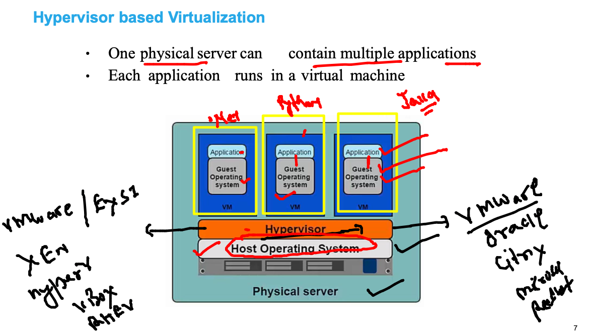
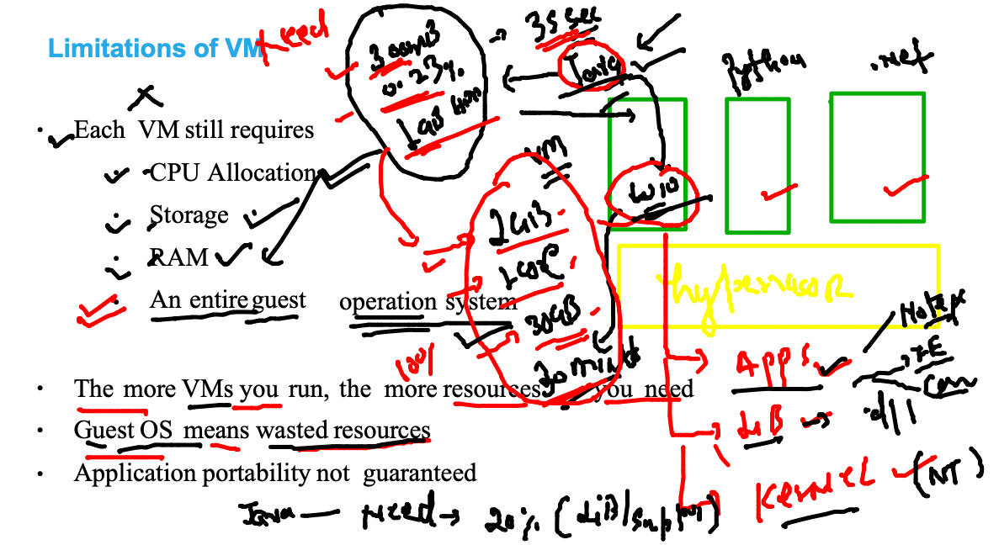
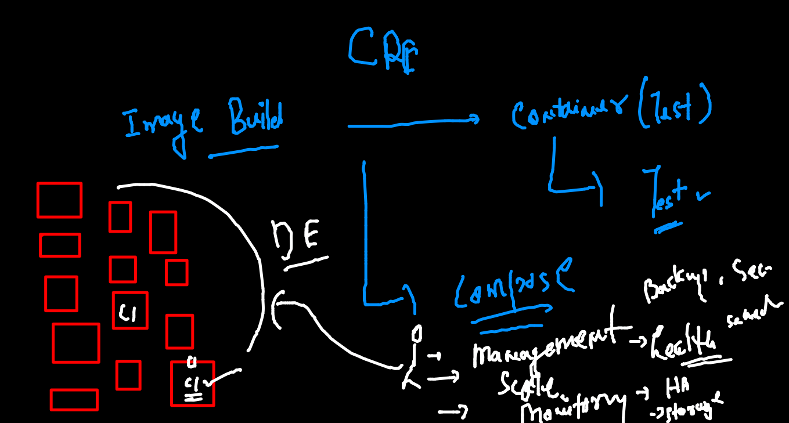

# Training Plan 


### app deployment / testing problem statement 


### VIRTUalization based solution using hypervisor 



### VM need OS and application doesn't required entire OS 



### Understanding OS 


### docker as Container runtime engine 



### list of CRE 


### gettting started with Docker -cE 


### Docker support with Host OS kernel 


### Docker installation in Windows / mac -- using docker Desktop 


### Mac OS Docker Desktop download 

[Download LInk](https://hub.docker.com/editions/community/docker-ce-desktop-mac)

### Windows 10 / 11 

[link Windows](https://docs.docker.com/desktop/windows/install/)

### Linux Server based Docker CE installation 

[LInk_linux](https://docs.docker.com/engine/install/)

### LInux 

```
 sudo yum  install docker  
 
   1  systemctl start  docker 
    2  systemctl status  docker 
    3  systemctl enable  docker 
    
 ```
 
###  checking remote connection with Docker 

```
ssh  ashu@18.206.144.59
The authenticity of host '18.206.144.59 (18.206.144.59)' can't be established.
ECDSA key fingerprint is SHA256:Id9ky8Mhzi35zZ16gHTqb2UuS8vXKct1VWxl0wjmqJY.
Are you sure you want to continue connecting (yes/no/[fingerprint])? yes
Warning: Permanently added '18.206.144.59' (ECDSA) to the list of known hosts.
ashu@18.206.144.59's password: 

       __|  __|_  )
       _|  (     /   Amazon Linux 2 AMI
      ___|\___|___|

https://aws.amazon.com/amazon-linux-2/
-bash: warning: setlocale: LC_CTYPE: cannot change locale (UTF-8): No such file or directory
[ashu@ip-172-31-80-220 ~]$ docker  -v
Docker version 20.10.7, build f0df350


```

### VScode SSH extension installation 


### checking connection 

```
[ashu@ip-172-31-80-220 ~]$ docker  version 
Client:
 Version:           20.10.7
 API version:       1.41
 Go version:        go1.15.14
 Git commit:        f0df350
 Built:             Wed Nov 17 03:05:36 2021
 OS/Arch:           linux/amd64
 Context:           default
 Experimental:      true

Server:
 Engine:
  Version:          20.10.7
  API version:      1.41 (minimum version 1.12)
  Go version:       go1.15.14
  Git commit:       b0f5bc3
  Built:            Wed Nov 17 03:06:14 2021
  OS/Arch:          linux/amd64
  Experimental:     false
  
 ```
 
 ### Creating containers 
 
 ### Docker registry 
 
 ### process 
 
 
 
 ### checking number of images in Docker engine 
 
 ```
  docker  images
REPOSITORY   TAG       IMAGE ID   CREATED   SIZE
[ashu@ip-172-31-80-220 ~]$ 


```

### Image commands 

```
 docker  images
REPOSITORY   TAG       IMAGE ID   CREATED   SIZE
[ashu@ip-172-31-80-220 ~]$ docker  pull  python 
Using default tag: latest
latest: Pulling from library/python
647acf3d48c2: Pull complete 
b02967ef0034: Pull complete 
e1ad2231829e: Pull complete 
5576ce26bf1d: Pull complete 
a66b7f31b095: Pull complete 
05189b5b2762: Pull complete 
af08e8fda0d6: Pull complete 
287d56f7527b: Pull complete 
dc0580965fb6: Pull complete 
Digest: sha256:f44726de10d15558e465238b02966a8f83971fd85a4c4b95c263704e6a6012e9
Status: Downloaded newer image for python:latest
docker.io/library/python:latest
[ashu@ip-172-31-80-220 ~]$ docker  images
REPOSITORY   TAG       IMAGE ID       CREATED      SIZE
python       latest    f48ea80eae5a   4 days ago   917MB

```

### pulling images 

```
 docker  pull oraclelinux
Using default tag: latest
Error response from daemon: manifest for oraclelinux:latest not found: manifest unknown: manifest unknown
[ashu@ip-172-31-80-220 ~]$ docker  pull oraclelinux:8.5
8.5: Pulling from library/oraclelinux
b791d4160c6a: Pull complete 
Digest: sha256:4126784fc096fa59538deae1917a143b9c40f9712a76b17f1d7c599b7953d33a
Status: Downloaded newer image for oraclelinux:8.5
docker.io/library/oraclelinux:8.5

```

### image pulled from docker hub 

```
docker  images
REPOSITORY    TAG       IMAGE ID       CREATED       SIZE
openjdk       latest    1b3756d6df61   3 days ago    471MB
oraclelinux   8.5       fa4253e97227   3 days ago    235MB
python        latest    f48ea80eae5a   4 days ago    917MB
mysql         latest    b05128b000dd   5 days ago    516MB
alpine        latest    0a97eee8041e   9 days ago    5.61MB
java          latest    d23bdf5b1b1b   4 years ago   643MB

```

### remove image from docker engine host 

```
docker  images
REPOSITORY    TAG       IMAGE ID       CREATED       SIZE
openjdk       latest    1b3756d6df61   3 days ago    471MB
oraclelinux   8.5       fa4253e97227   3 days ago    235MB
python        latest    f48ea80eae5a   4 days ago    917MB
mysql         latest    b05128b000dd   5 days ago    516MB
alpine        latest    0a97eee8041e   9 days ago    5.61MB
java          latest    d23bdf5b1b1b   4 years ago   643MB
[ashu@ip-172-31-80-220 ~]$ 
[ashu@ip-172-31-80-220 ~]$ docker rmi f48ea80eae5a
Untagged: python:latest
Untagged: python@sha256:f44726de10d15558e465238b02966a8f83971fd85a4c4b95c263704e6a6012e9
Deleted: sha256:f48ea80eae5a5683e2a734cf4697827339af3ced11e26d0ad58433ddf6fac24f
Deleted: sha256:55e6f2791e23276aa859c0aad3e50cf3c5b2106b8b44008524d1003acd1719e9
Deleted: sha256:ddc59c6f64be64a3b94c16cbccc7f165dc372c

```

### pulling image from quay.io registry 

```
 docker pull quay.io/bitnami/python
Using default tag: latest
latest: Pulling from bitnami/python
ad3e435fd20e: Pull complete 
9c0e19020083: Pull complete 
bb3b400d4983: Pull complete 
ffc41b324e24: Pull complete 
df97a6b6cd38: Pull complete 
da56ae5b7d0c: Pull complete 
Digest: sha256:f59b2a06eb05e85e85a608719a96e4af8467fa030833e47b5380fec2dbb1181e
Status: Downloaded newer image for quay.io/bitnami/python:latest
quay.io/bitnami/python:latest
[ashu@ip-172-31-80-220 ~]$ docker  images
REPOSITORY               TAG       IMAGE ID       CREATED       SIZE
quay.io/bitnami/python   latest    3f9d02ad81fb   6 hours ago   494MB
openjdk                  latest    1b3756d6df61   3 days ago    471MB
oraclelinux              8.5       fa4253e97227   3 days ago    235MB
mysql                    latest    b05128b000dd   5 days ago    516MB

```

### Container from docker image 


### creating first ever container 

```
 docker run  --name  ashuc1   -d   alpine:latest   ping  google.com   
f535bcfe90169391938268ee9b5afddaa49d3e05aa096522fb6f9246c9312cff
[ashu@ip-172-31-80-220 ~]$ docker  ps
CONTAINER ID   IMAGE           COMMAND             CREATED         STATUS         PORTS     NAMES
f535bcfe9016   alpine:latest   "ping google.com"   8 seconds ago   Up 7 seconds             ashuc1

```

### to check output of container process

```
 42  docker  logs  ashuc1
   43  docker  logs  -f ashuc1
   
```

### container more operations 

```
 docker  stop  ashuc1
ashuc1

===

 docker  start  ashuc1
ashuc1

===

docker  kill ashuc1
ashuc1
[ashu@ip-172-31-80-220 ~]$ docker  rm  ashuc1
ashuc1

```


