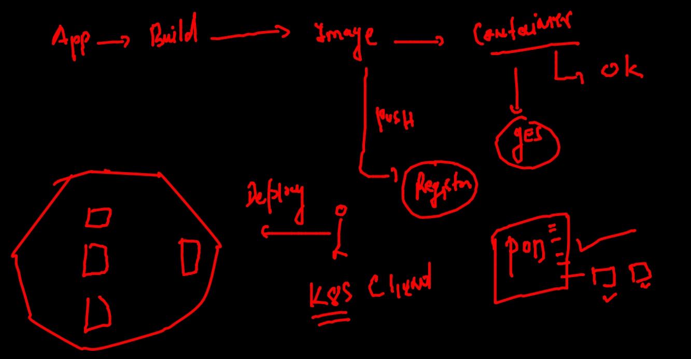
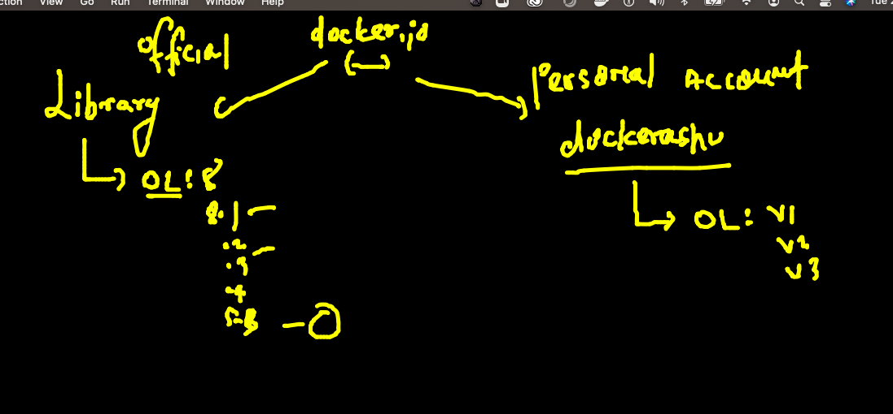

# Training Plan 


## Revision 



### docker arch 


## few more operations in docker 

### checking resources consumption 

```
docker  stats  nikhil 
CONTAINER ID   NAME      CPU %     MEM USAGE / LIMIT   MEM %     NET I/O           BLOCK I/O     PIDS
0a6b29904136   nikhil    0.01%     380KiB / 7.761GiB   0.00%     12.2kB / 11.1kB   1.14MB / 0B   1

```

### kill all the running container 

```
[ashu@ip-172-31-80-220 ~]$ docker kill  $(docker  ps  -q)
aaf063e8b5f7
f11f045c8eba
0a6b29904136
5ce9c1b6329e
da17712f979b
13c7c64a67d8
5fd777103a6e
8ef121f58e2a
2b7794f11403
39cf96a655fe
ca367ec62397
30b851ded07e
[ashu@ip-172-31-80-220 ~]$ docker  ps
CONTAINER ID   IMAGE     COMMAND   CREATED   STATUS    PORTS     NAMES

```

### removing all containers 

```
 docker  rm $(docker  ps  -aq)
aaf063e8b5f7
f11f045c8eba
0a6b29904136
5ce9c1b6329e
da17712f979b

```

### creating container 

```
docker run -it   centos   bash 
Unable to find image 'centos:latest' locally
latest: Pulling from library/centos
a1d0c7532777: Pull complete 
Digest: sha256:a27fd8080b517143cbbbab9dfb7c8571c40d67d534bbdee55bd6c473f432b177
Status: Downloaded newer image for centos:latest
[root@ed213b5917c0 /]# 
[root@ed213b5917c0 /]# 
[root@ed213b5917c0 /]# cat  /etc/os-release 
NAME="CentOS Linux"
VERSION="8"
ID="centos"
ID_LIKE="rhel fedora"
VERSION_ID="8"
PLATFORM_ID="platform:el8"
PRETTY_NAME="CentOS Linux 8"
ANSI_COLOR="0;31"
CPE_NAME="cpe:/o:centos:centos:8"
HOME_URL="https://centos.org/"
BUG_REPORT_URL="https://bugs.centos.org/"
CENTOS_MANTISBT_PROJECT="CentOS-8"
CENTOS_MANTISBT_PROJECT_VERSION="8"
[root@ed213b5917c0 /]# exit
exit
[ashu@ip-172-31-80-220 ~]$ docker ps
CONTAINER ID   IMAGE     COMMAND   CREATED   STATUS    PORTS     NAMES
[ashu@ip-172-31-80-220 ~]$ docker ps -a
CONTAINER ID   IMAGE     COMMAND   CREATED          STATUS                     PORTS     NAMES
ed213b5917c0   centos    "bash"    31 seconds ago   Exited (0) 9 seconds ago             objective_tereshkova

```

### login into existing container 

```
ashu@ip-172-31-80-220 ~]$ docker ps
CONTAINER ID   IMAGE     COMMAND   CREATED         STATUS        PORTS     NAMES
ed213b5917c0   centos    "bash"    2 minutes ago   Up 1 second             objective_tereshkova
[ashu@ip-172-31-80-220 ~]$ docker  exec  -it  ed213b5917c0  bash
[root@ed213b5917c0 /]# 
[root@ed213b5917c0 /]# 
[root@ed213b5917c0 /]# exit
exit
[ashu@ip-172-31-80-220 ~]$ docker run -d --name x1  alpine ping fb.com 
6886cbb39515ee3328316f6257a8817b29d039992b8df5e817200d0d2d46c424
[ashu@ip-172-31-80-220 ~]$ docker  ps
CONTAINER ID   IMAGE     COMMAND         CREATED         STATUS          PORTS     NAMES
6886cbb39515   alpine    "ping fb.com"   2 seconds ago   Up 1 second               x1
ed213b5917c0   centos    "bash"          2 minutes ago   Up 39 seconds             objective_tereshkova
[ashu@ip-172-31-80-220 ~]$ 
[ashu@ip-172-31-80-220 ~]$ 
[ashu@ip-172-31-80-220 ~]$ docker  exec -it x1  sh 
/ # 
/ # 
/ # cat /etc/os-release 
NAME="Alpine Linux"
ID=alpine
VERSION_ID=3.14.3
PRETTY_NAME="Alpine Linux v3.14"
HOME_URL="https://alpinelinux.org/"
BUG_REPORT_URL="https://bugs.alpinelinux.org/"
/ # exit

```

## app containerization 


### image buildng process


### PYthon code containerization 


### building first image 

### Dockerfile 

```
FROM oraclelinux:8.5 
# image will be pulled from Docker HUB 
LABEL name=ashutoshh
LABEL email=ashutoshh@linux.com 
# image designer details but optional field
RUN yum install python3 -y 
# during image build time RUN will give
# shell access to write any cmd / script
RUN mkdir  /code 
COPY oracle.py  /code/oracle.py 
# from Dockerfile location to image during build time
CMD ["python3","/code/oracle.py"]
#  to set default process for this docker image 
# docker run -it -d --name x1 image   


```

```
$ ls
Dockerfile  oracle.py
[ashu@ip-172-31-80-220 pythonapp]$ docker build  -t   ashupython:v1  . 
Sending build context to Docker daemon  3.072kB
Step 1/7 : FROM oraclelinux:8.5
 ---> fa4253e97227
Step 2/7 : LABEL name=ashutoshh
 ---> Running in 8686d165f3d9
Removing intermediate container 8686d165f3d9
 ---> d3b9be373c72
Step 3/7 : LABEL email=ashutoshh@linux.com
 ---> Running in 86b07e3c005e
Removing intermediate container 86b07e3c005e
 ---> 3cfe437b046a
Step 4/7 : RUN yum install python3 -y
 ---> Running in fe939bae532b
Oracle Linux 8 BaseOS Latest (x86_64)            49 MB/s |  40 MB     00:00    

```

### checking images 

```
[ashu@ip-172-31-80-220 pythonapp]$ docker  images
REPOSITORY               TAG       IMAGE ID       CREATED          SIZE
madhuri1                 1         26f79fa6e57e   5 seconds ago    399MB
shyampy                  v1        784e614ebb18   12 seconds ago   399MB
ash_python               v1        556adf4c7864   13 seconds ago   399MB
ashupython               v1        df5d1b3b0693   13 seconds ago   399MB

```

### checking image build history 

```
 docker  history  ashupython:v1
IMAGE          CREATED          CREATED BY                                      SIZE      COMMENT
df5d1b3b0693   25 minutes ago   /bin/sh -c #(nop)  CMD ["python3" "/code/ora…   0B        
0411cb821531   25 minutes ago   /bin/sh -c #(nop) COPY file:6e29d47c004b1169…   231B      
9a604bdcff0c   25 minutes ago   /bin/sh -c mkdir  /code                         0B        
bca0e621c54c   25 minutes ago   /bin/sh -c yum install python3 -y               164MB     
3cfe437b046a   26 minutes ago   /bin/sh -c #(nop)  LABEL email=ashutoshh@lin…   0B        
d3b9be373c72   26 minutes ago   /bin/sh -c #(nop)  LABEL name=ashutoshh         0B        
fa4253e97227   4 days ago       /bin/sh -c #(nop)  CMD ["/bin/bash"]            0B        
<missing>      4 days ago       /bin/sh -c #(nop) ADD file:4e55964bdaba265f1…   235MB 

```

### creating container from default image 

```
docker  run -it -d --name ashuc1  ashupython:v1 
ff7066ae07df69b2b9d24e80a1e842ec7dc86941208d667471b9117570ffc641
[ashu@ip-172-31-80-220 pythonapp]$ docker  ps
CONTAINER ID   IMAGE           COMMAND                  CREATED             STATUS             PORTS     NAMES
ff7066ae07df   ashupython:v1   "python3 /code/oracl…"   11 seconds ago      Up 10 seconds                ashuc1

```

### checking output of container app 

```
docker logs -f  ashuc1

```

### accessing contianer 

```

docker  exec -it  ashuc1  bash 
[root@ff7066ae07df /]# cd /code/
[root@ff7066ae07df code]# ls
oracle.py
[root@ff7066ae07df code]# cat  /etc/os-release 
NAME="Oracle Linux Server"
VERSION="8.5"
ID="ol"
ID_LIKE="fedora"
VARIANT="Server"
VARIANT_ID="server"
VERSION_ID="8.5"
PLATFORM_ID="platform:el8"
PRETTY_NAME="Oracle Linux Server 8.5"
ANSI_COLOR="0;31"
CPE_NAME="cpe:/o:oracle:linux:8:5:server"
HOME_URL="https://linux.oracle.com/"
BUG_REPORT_URL="https://bugzilla.oracle.com/"

ORACLE_BUGZILLA_PRODUCT="Oracle Linux 8"
ORACLE_BUGZILLA_PRODUCT_VERSION=8.5
ORACLE_SUPPORT_PRODUCT="Oracle Linux"
ORACLE_SUPPORT_PRODUCT_VERSION=8.5
[root@ff7066ae07df code]# exit
exit

```

### removing container 

```
$ docker stop  ashuc1 
ashuc1
[ashu@ip-172-31-80-220 pythonapp]$ docker  rm  ashuc1
ashuc1

```

### changing in app need rebuild 

```
 ls
oracle.dockerfile  oracle.py
[ashu@ip-172-31-80-220 pythonapp]$ docker build -t  ashupython:v2  -f  oracle.dockerfile  .  
Sending build context to Docker daemon  3.072kB
Step 1/7 : FROM oraclelinux:8.5
 ---> fa4253e97227
Step 2/7 : LABEL name=ashutoshh
 ---> Using cache
 ---> d3b9be373c72
Step 3/7 : LABEL email=ashutoshh@linux.com
 ---> Using cache
 
 ```
 
 ### Docker build is using cache 
 
 ```
  142  docker build -t  ashupython:v2  -f  oracle.dockerfile  .  
  143  history 
  144  docker build -t  ashupython:v2  -f  oracle.dockerfile --no-cache    .  
  
  ```
  
  ### COntainer data copy and its isolation using Namespace 
  
  
  
  ### Solution to container data copy assignment 
  
  ```
   150  docker  run -itd --name ashuc1  alpine 
  151  docker  run -itd --name ashuc2  alpine 
  152  docker ps
  153  history 
[ashu@ip-172-31-80-220 pythonapp]$ docker  exec -it ashuc1  sh 
/ # 
/ # 
/ # pwd
/
/ # ls
bin    dev    etc    home   lib    media  mnt    opt    proc   root   run    sbin   srv    sys    tmp    usr    var
/ # echo  hello world  >helloc1.txt 
/ # ls
bin          etc          home         media        opt          root         sbin         sys          usr
dev          helloc1.txt  lib          mnt          proc         run          srv          tmp          var
/ # cat  helloc1.txt 
hello world
/ # exit
[ashu@ip-172-31-80-220 pythonapp]$ docker  cp  ashuc1:/helloc1.txt  . 
[ashu@ip-172-31-80-220 pythonapp]$ ls
helloc1.txt  oracle.dockerfile  oracle.py
[ashu@ip-172-31-80-220 pythonapp]$ docker  cp  helloc1.txt  ashuc2:/
[ashu@ip-172-31-80-220 pythonapp]$ docker exec -it ashuc2 sh 
/ # ls
bin          etc          home         media        opt          root         sbin         sys          usr
dev          helloc1.txt  lib          mnt          proc         run          srv          tmp          var
/ # exit

```

### Java code based Dockerfile 

```
FROM openjdk 
LABEL email=ashutoshh@linux.com 
RUN mkdir /mycode 
ADD oracle.java /mycode/oracle.java 
# COPY and ADD both are doing same job except one change
# ADD can also take data from URL while copy can't 
WORKDIR /mycode
# to change directory during image build time 
RUN javac  oracle.java 
# compiling java code 
CMD ["java","myclass"]
# default process 

```

### Building image 

```
cd  javaapp/
[ashu@ip-172-31-80-220 javaapp]$ ls
Dockerfile  oracle.java
[ashu@ip-172-31-80-220 javaapp]$ docker build -t ashujava:v1  . 
Sending build context to Docker daemon  3.072kB
Step 1/7 : FROM openjdk
 ---> 1b3756d6df61
Step 2/7 : LABEL email=ashutoshh@linux.com
 ---> Running in f27a4bd83544
Removing intermediate container f27a4bd83544
 ---> 967cc1424c25
```

### creating java container 

```
 docker run -itd --name  ashujc1  ashujava:v1
 
docker  exec -it  ashujc1  bash 
bash-4.4# 
bash-4.4# java -version 
openjdk version "17.0.1" 2021-10-19
OpenJDK Runtime Environment (build 17.0.1+12-39)
OpenJDK 64-Bit Server VM (build 17.0.1+12-39, mixed mode, sharing)
bash-4.4# jps
1 myclass
50 Jps
bash-4.4# exit
exit

```

### dockerfile with custom jdk version 

### dockerfile 

```
FROM oraclelinux:8.5 
LABEL email=ashutoshh@linux.com 
RUN dnf install java-1.8.0-openjdk.x86_64 java-1.8.0-openjdk-devel.x86_64 -y 
RUN mkdir /mycode 
ADD oracle.java /mycode/oracle.java 
# COPY and ADD both are doing same job except one change
# ADD can also take data from URL while copy can't 
WORKDIR /mycode
# to change directory during image build time 
RUN javac  oracle.java 
# compiling java code 
CMD ["java","myclass"]
# default process 

```

### building 

```
 cd  javaapp/
[ashu@ip-172-31-80-220 javaapp]$ ls
Dockerfile  jdk8.dockerfile  oracle.java
[ashu@ip-172-31-80-220 javaapp]$ docker  build  -t  ashujava:jdk8  -f  jdk8.dockerfile  . 
Sending build context to Docker daemon  4.096kB
Step 1/8 : FROM oraclelinux:8.5
 ---> fa4253e97227
Step 2/8 : LABEL email=ashutoshh@linux.com
 ---> Running in 16c611590ced
Removing intermediate container 16c611590ced
 ---> 1747921ec3ac
Step 3/8 : RUN dnf install java-1.8.0-openjdk.x86_64 java-1.8.0-openjdk-devel.x86_64 -y
 ---> Running in 80aa590f7f79
 
 ```
 
 ### creating container and checking it 
 
 ```
  docker  run -itd --name  ashujcc2   ashujava:jdk8 
 docker  exec -it ashujcc2   bash 
[root@2dc9c5a7788a mycode]# 
[root@2dc9c5a7788a mycode]# jps
1 myclass
34 Jps
[root@2dc9c5a7788a mycode]# java -version 
openjdk version "1.8.0_312"
OpenJDK Runtime Environment (build 1.8.0_312-b07)
OpenJDK 64-Bit Server VM (build 25.312-b07, mixed mode)
[root@2dc9c5a7788a mycode]# exit
exit

```
### Docker hub the public image registry 


### pushing image to docker hub 

```
docker  images  |  grep -i ashu
ashujava                 v1        1244c5d2aa5f   8 minutes ago       471MB
ashujava                 jdk8      e3545ddc067d   About an hour ago   601MB
ashupython               v2        ddcb5220dcd1   3 hours ago         399MB
ashupython               v1        df5d1b3b0693   3 hours ago         399MB
[ashu@ip-172-31-80-220 appimages]$ 
[ashu@ip-172-31-80-220 appimages]$ docker  tag  df5d1b3b0693    dockerashu/oracleapps:v1 
[ashu@ip-172-31-80-220 appimages]$ docker  images  |  grep -i ashu
ashujava                 v1        1244c5d2aa5f   8 minutes ago       471MB
ashujava                 jdk8      e3545ddc067d   About an hour ago   601MB
ashupython               v2        ddcb5220dcd1   3 hours ago         399MB
dockerashu/oracleapps    v1        df5d1b3b0693   3 hours ago         399MB
ashupython               v1        df5d1b3b0693   3 hours ago         399MB
[ashu@ip-172-31-80-220 appimages]$ 
[ashu@ip-172-31-80-220 appimages]$ docker login 
Login with your Docker ID to push and pull images from Docker Hub. If you don't have a Docker ID, head over to https://hub.docker.com to create one.
Username: dockerashu
Password: 
WARNING! Your password will be stored unencrypted in /home/ashu/.docker/config.json.
Configure a credential helper to remove this warning. See
https://docs.docker.com/engine/reference/commandline/login/#credentials-store

Login Succeeded
[ashu@ip-172-31-80-220 appimages]$ docker  push  dockerashu/oracleapps:v1
The push refers to repository [docker.io/dockerashu/oracleapps]
dc1c2075bf15: Pushed 
ddf2bf4e41db: Pushing  2.048kB
fc08c08f0eb6: Pushing  551.4kB/164MB
c029303805d7: Mounted from library/oraclelinux 

```

### some info about Docker hub 



### pulling image from different docker engine 

```
docker pull  dockerashu/oracleapps:v1 
v1: Pulling from dockerashu/oracleapps
b791d4160c6a: Downloading  6.966MB/87.47MB
46cff73f858e: Downloading  6.444MB/115.4MB
f1f3e6d3af9c: Download complete 
dab3a8909c9f: Download complete 

```


