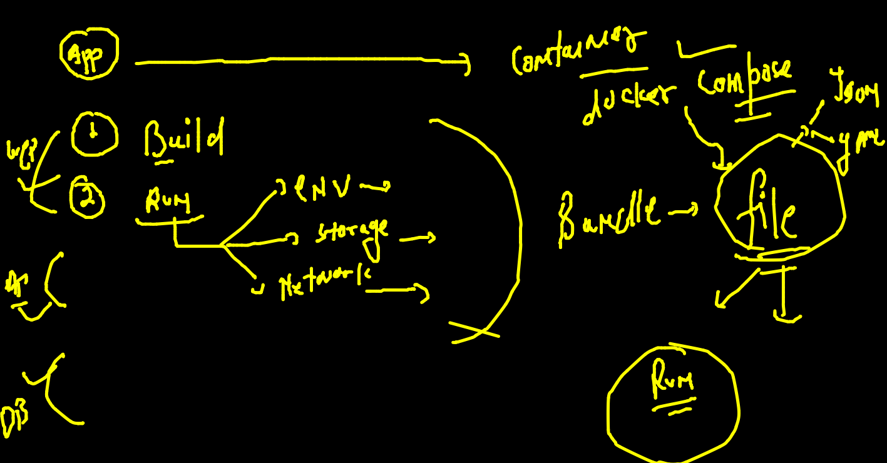

# Training Plan 


## Revision 


### Container 

```
 docker network  create  ashubr1
afe37a90e1c7239abb246cab163a08ed9a5526e0b153a03acacefcb6a27a056b
[ashu@ip-172-31-80-220 appimages]$ docker network ls
NETWORK ID     NAME      DRIVER    SCOPE
afe37a90e1c7   ashubr1   bridge    local
da65410a2c6d   bridge    bridge    local
f935aeaccb11   host      host      local
d825610a8d02   none      null      local
[ashu@ip-172-31-80-220 appimages]$ docker run -itd --name c3  --network  ashubr1    alpine 
d075f1ce6d2644e709ca72d5137b3452fb0aafe69d81b1ebf74d69ead38714af
[ashu@ip-172-31-80-220 appimages]$ docker run -itd --name c4  --network  ashubr1    alpine 
dfe1c34a68a41c64032fc3978a15b2541e3a2d36c52de26605a7c67e140b1539
[ashu@ip-172-31-80-220 appimages]$ 
[ashu@ip-172-31-80-220 appimages]$ docker exec -it  c3  sh 
/ # 
/ # ping  c4
PING c4 (172.18.0.3): 56 data bytes
64 bytes from 172.18.0.3: seq=0 ttl=64 time=0.082 ms
64 bytes from 172.18.0.3: seq=1 ttl=64 time=0.085 ms
^C
--- c4 ping statistics ---
2 packets transmitted, 2 packets received, 0% packet loss
round-trip min/avg/max = 0.082/0.083/0.085 ms
/ # exit

```

### network 

```
350   docker network  create  ashubr2 --subnet  192.168.1.0/24 
  351  docker run -itd --name c5  --network ashubr2  alpine 
  352  docker run -itd --name c6  --network ashubr2 --ip 192.168.1.100  alpine
  
```

### container to image 

```
363  docker run -it  --name ashuc11  centos bash 
  364  history 
[ashu@ip-172-31-80-220 appimages]$ docker  commit ashuc11  ashucimg:v007  
sha256:7bd19e44dd4f92dae7dbf31bde1f1db78f618cd3a88bf5504ef8e067c9ff544c
[ashu@ip-172-31-80-220 appimages]$ 
[ashu@ip-172-31-80-220 appimages]$ docker  tag  ashucimg:v007  dockerashu/orday3:v3 
[ashu@ip-172-31-80-220 appimages]$ 
[ashu@ip-172-31-80-220 appimages]$ docker login -u dockerashu
Password: 
WARNING! Your password will be stored unencrypted in /home/ashu/.docker/config.json.
Configure a credential helper to remove this warning. See
https://docs.docker.com/engine/reference/commandline/login/#credentials-store

Login Succeeded
[ashu@ip-172-31-80-220 appimages]$ docker push  dockerashu/orday3:v3
The push refers to repository [docker.io/dockerashu/orday3]
338f4be3981d: Pushed 
74ddd0ec08fa: Mounted from varunssai/varundockerapps 
v3: digest: sha256:748b7e49b4e46aae552b576b1d375ea5bd2b9c7306316e93f1d2afea8be2fced size: 741

```

### Storage in Container 


### creating volume in docker engine 

```
docker  volume  create  ashuvol1 
ashuvol1
[ashu@ip-172-31-80-220 appimages]$ docker  volume  ls
DRIVER    VOLUME NAME
local     ashuvol1
local     shared
[ashu@ip-172-31-80-220 appimages]$ docker  volume  inspect  ashuvol1 
[
    {
        "CreatedAt": "2021-11-24T05:11:37Z",
        "Driver": "local",
        "Labels": {},
        "Mountpoint": "/var/lib/docker/volumes/ashuvol1/_data",
        "Name": "ashuvol1",
        "Options": {},
        "Scope": "local"
    }
]

```

### access storage in back ground 


### mounting external location from docker host to container 

```
docker  run -itd  --name ashupyc1  -v  /home/ashu/appimages/pythonapp/:/code111/    ashupython:v1   python3  /code111/oracle.py 

```

### mounting host data 

```
docker run -it --rm   -v  /etc:/myetc:ro  alpine sh 
/ # 
/ # 
/ # cd  /myetc/
/myetc # ls
DIR_COLORS               exports                  man_db.conf              rsyncd.conf
DIR_COLORS.256color      exports.d                mke2fs.conf              rsyslog.conf
DIR_COLORS.lightbgcolor  filesystems              modprobe.d               rsyslog.d
GREP_COLORS              fstab                    modules-load.d           rwtab
GeoIP.conf               gcrypt                   motd                     rwtab.d
GeoIP.conf.default       gnupg                    mtab                     sasl2
NetworkManager           groff                    m

```

### remove volumes 

```
 docker volume  prune 
WARNING! This will remove all local volumes not used by at least one container.
Are you sure you want to continue? [y/N] y
Deleted Volumes:
krishnavol1
varunvol1
royvol
vamshivol1
shared
Saravana2505
ashuvol1

```

### mysql DB instance launch 

```
docker  run -itd  --name  ashudb11  -v  /tmp/ashudb:/var/lib/mysql/      -e  MYSQL_ROOT_PASSWORD=Orpass077  mysql:5.7 

 docker  exec -it  ashudb11  bash 
root@2330c5611c60:/# 
root@2330c5611c60:/# mysql -u root -p 
Enter password: 
Welcome to the MySQL monitor.  Commands end with ; or \g.
Your MySQL connection id is 3
Server version: 5.7.36 MySQL Community Server (GPL)

Copyright (c) 2000, 2021, Oracle and/or its affiliates.

Oracle is a registered trademark of Oracle Corporation and/or its
affiliates. Other names may be trademarks of their respective
owners.

Type 'help;' or '\h' for help. Type '\c' to clear the current input statement.

mysql> ^DBye

```

### Docker COmpose 



### COmpsoe file 


### installing compose client 

```
 sudo curl -L "https://github.com/docker/compose/releases/download/1.29.2/docker-compose-$(uname -s
)-$(uname -m)" -o /usr/local/bin/docker-compose
  % Total    % Received % Xferd  Average Speed   Time    Time     Time  Current
                                 Dload  Upload   Total   Spent    Left  Speed
100   633  100   633    0     0  37235      0 --:--:-- --:--:-- --:--:-- 39562
100 12.1M  100 12.1M    0     0  79.3M      0 --:--:-- --:--:-- --:--:-- 97.1M
[ec2-user@ip-172-31-80-220 ~]$ sudo chmod +x /usr/local/bin/docker-compose
[ec2-user@ip-172-31-80-220 ~]$ sudo ln -s /usr/local/bin/docker-compose /usr/bin/docker-compos
[ec2-user@ip-172-31-80-220 ~]$ 
[ec2-user@ip-172-31-80-220 ~]$ 
[ec2-user@ip-172-31-80-220 ~]$ docker-compos -v
docker-compose version 1.29.2, build 5becea4c
[ec2-user@ip-172-31-80-220 ~]$ 

```

### COmpsoe file 1 

```
version: '3.8' 
services:
 ashuapp1: # first container based app info 
  image: alpine
  container_name: ashuc123
  command: ping fb.com 
  
 ashuapp2: # second container based app info 
  image: nginx 
  container_name: ashucc222
  ports:
   - 3399:80 
  volumes:
   - "/mnt:/new"

```

### run file 

```

docker-compose up -d
Creating network "ashutoshhcompose_default" with the default driver
Creating ashuc123  ... done
Creating ashucc222 ... done


[ashu@ip-172-31-80-220 ashutoshhcompose]$ docker-compose ps 
  Name                 Command               State                  Ports                
-----------------------------------------------------------------------------------------
ashuc123    ping fb.com                      Up                                          
ashucc222   /docker-entrypoint.sh ngin ...   Up      0.0.0.0:3399->80/tcp,:::3399->80/tcp
[ashu@ip-172-31-80-220 ashutoshhcompose]$ 


docker-compose  stop 
Stopping ashucc222 ... done
Stopping ashuc123  ... 


 docker-compose  start ashuapp1
Starting ashuapp1 ... done
[ashu@ip-172-31-80-220 ashutoshhcompose]$ docker-compose ps 
  Name                 Command               State    Ports
-----------------------------------------------------------
ashuc123    ping fb.com                      Up            
ashucc222   /docker-entrypoint.sh ngin ...   Exit 0 


```

###  differenent file name 

```
docker-compose -f   oralce.yaml  up  -d 
Creating network "ashutoshhcompose_default" with the default driver
Creating ashuc123  ... done
Creating ashucc222 ... done
[ashu@ip-172-31-80-220 ashutoshhcompose]$ docker-compose -f   oralce.yaml  down 
Stopping ashucc222 ... done
Stopping ashuc123  ... 

```

###

```
 docker-compos -f  ashutoshhcompose/oralce.yaml  up -d
Creating network "ashutoshhcompose_default" with the default driver
Creating ashuc123  ... done
Creating ashucc222 ... done
[ashu@ip-172-31-80-220 appimages]$ docker-compos -f  ashutoshhcompose/oralce.yaml   down 
Stopping ashucc222 ... done
Stopping ashuc123  ... 


```

### Docker client options 


### portainer in docker engine 

```
 docker  run -tid --name webui -p 9000:9000 -v  /var/run/docker.sock:/var/run/docker.sock    portainer/portainer
 
```


