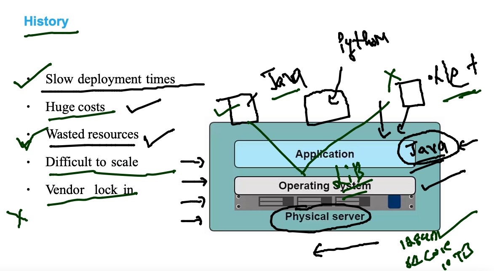
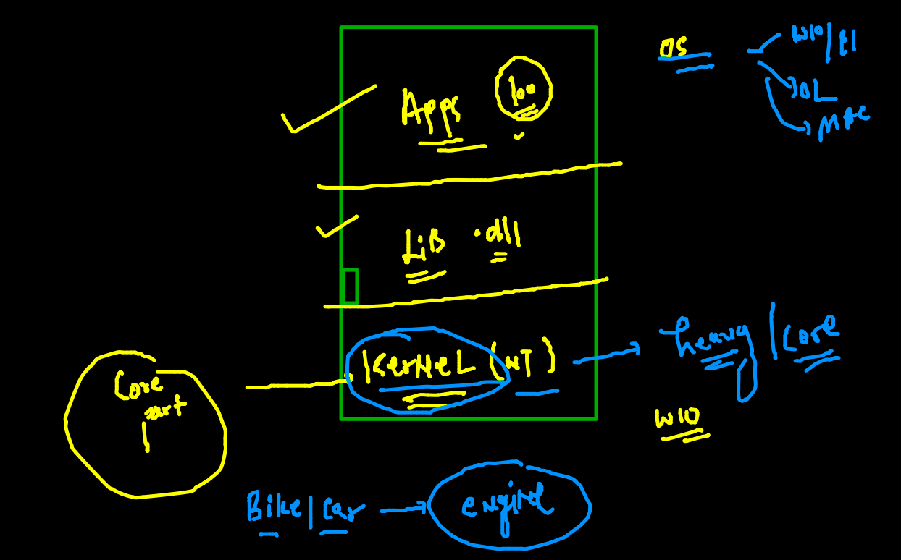

# Training Plan 


### app deployment / testing problem statement 



### VIRTUalization based solution using hypervisor 


### VM need OS and application doesn't required entire OS 


### Understanding OS 



### docker as Container runtime engine 


### list of CRE 


### gettting started with Docker -cE 


### Docker support with Host OS kernel 


### Docker installation in Windows / mac -- using docker Desktop 


### Mac OS Docker Desktop download 

[Download LInk](https://hub.docker.com/editions/community/docker-ce-desktop-mac)

### Windows 10 / 11 

[link Windows](https://docs.docker.com/desktop/windows/install/)

### Linux Server based Docker CE installation 

[LInk_linux](https://docs.docker.com/engine/install/)

### LInux 

```
 sudo yum  install docker  
 
   1  systemctl start  docker 
    2  systemctl status  docker 
    3  systemctl enable  docker 
    
 ```
 
 


